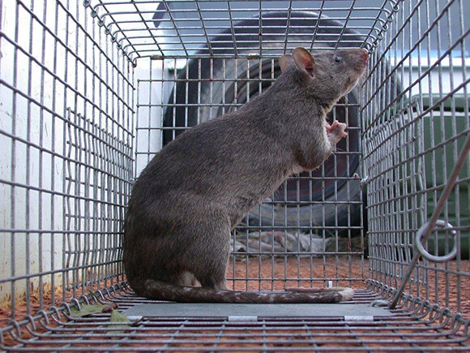

<content-header icon="rodents" title="Gambian giant pouched rat" subtitle="Cricetomys gambianus">
</content-header>

<figcaption>Photo: FWC</figcaption>

### Overall vulnerability:

Moderate

### Conservation status:

Non-native

## General Information

A non-native species to Florida, the Gambian pouched rat is the largest rat in the world. This rat can weigh up to 9 pounds and is usually between 20 and 35 inches in length. These nocturnal rodents typically spend their time on the ground, although they are expert climbers.  In Florida, this species is limited to Grassy Key and eats a diet consisting of insects, snails, nuts, seeds, and fruits. However, like many rats they are opportunistic feeders and are known to eat pet food whenever available.  Gambian pouched rats are prohibited in the state of Florida, and efforts to prevent their spread to the mainland are in effect.  The rat’s potential spread throughout Florida is a concern because of their capability to become invasive, spread disease and become agricultural pests.

## Habitat Requirements

The Gambian pouched rat inhabits natural holes, crevices, hollow trees, and areas around human dwellings. In Florida, these rats are often attracted to human dwellings by the scents of food and garbage.

**TODO: habitat crosslinks**

## Climate Impacts

The Gambian pouched rat is prohibited in the state of Florida and efforts to eradicate the small Grassy Key population are underway.  Ecological transformations fueled by climate change may create an environment where invasive species like the Gambian pouched rat can easily thrive and spread, placing strain on native ecosystems.  As an opportunistic species native to a very warm climate, the pouched rat may adapt well to a changing climate and outcompete native species.

[More information about general climate impacts to species in Florida](/impacts/species).

## Vulnerability Assessment(s)

The overall vulnerability level (Moderate) was based on the following assessment(s).
#### 

<h3><a href="/impacts/vulnerability/ccvi">Climate Change Vulnerability Index</a></h3>

Moderately vulnerable

 

The majority of factors identified as potentially influencing "vulnerability" for the Gambian giant pouched rat are related to the fact that it is currently restricted to the Florida Keys, suggesting that if it were to be introduced to the Florida peninsula, the species would potentially be able to expand its distribution and would be either unaffected by or even potentially benefit from projected climate change.  Greater than 90% of the current range in Florida would be impacted by a 1-meter sea level rise.  This species is believed to need regular access to freshwater for drinking, which is already somewhat limited on the Florida Keys and may become more so with projected climate change.  Modeling suggests that even under current climate conditions, the potential spread of Gambian giant pouched rats would be very large if they reach mainland Florida due to the adaptability of this species, the thermal and moisture regimes in which they occur in their native range, and the variety of foods and habitat they can use.

## Adaptation Strategies

- As a nonnative and potentially harmful, invasive species, the goal is to eradicate Gambian pouched rats from Florida rather than to help the species adapt to a changing climate.  Strict efforts to remove wild rats from Grassy Key and prevent their spread to other areas should be continued.

[More information about adaptation strategies](/strategies).

## Additional Resources

- [Florida Fish and Wildlife Conservation Commission Species Profile](https://myfwc.com/wildlifehabitats/nonnatives/mammals/rodents/gambian-pouched-rat/)
