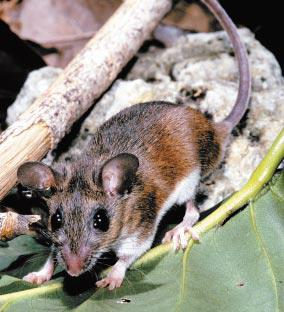

<content-header icon="rodents" title="Key Largo cotton mouse" subtitle="Peromyscus gossypinus allapaticola"></content-header>

<figcaption>Photo: FWC</figcaption>

### Overall vulnerability:

Very High

### Conservation status:

Federally Endangered

## General Information

At a body length of about 7 inches, this subspecies of cotton mouse is the largest found within peninsular Florida.  Key Largo cotton mice have hazel colored backs and white bellies that camouflage well in their hardwood hammock habitats.  Endemic to Key Largo, Florida, this cotton mouse forages for a diet of berries, seeds, nuts and insects and nests in fallen logs and tree stumps throughout the year with peaks in the spring and fall.

## Habitat Requirements

The Key Largo cotton mouse inhabits tropical hardwood hammock habitats within its small geographic range.

**TODO: habitat crosslinks**

**TODO: habitat map (if exists)**

## Climate Impacts

The Key Largo cotton mouse is also susceptible to sea level rise.  Additionally, this species faces many of the same existing threats common to coastal or island species: habitat loss and degradation from coastal development, barriers to migration, habitat disturbance from recreational use and high mortality from non-native predators.  Competition with black rats is also a serious current threat to this species with the potential to worsen under climate change.

[More information about general climate impacts to species in Florida](/impacts/species).

## Vulnerability Assessment(s)

The overall vulnerability level (Very High) was based on the following assessment(s).
#### 

<h3><a href="/impacts/vulnerability/sivva/species">Standardized Index of Vulnerability and Value Assessment</a></h3>

Extremely vulnerable

 

The primary factors contributing to vulnerability of the Key Largo cotton mouse are sea level rise, presence of barriers, habitat fragmentation, changes in salinity, and runoff and storm surge.

## Adaptation Strategies

- Conservation of existing habitat will allow the Key Largo cotton mouse the best chance of recovering and maintaining a healthy population as climate change begins to accelerate.  This includes controlling existing stressors, such as reducing populations of non-native predators.

- As sea level rise may eventually become too great a threat for the Key Largo cotton mouse in its current habitat, developing and maintaining a captive breeding population is a strategy to consider for this endemic subspecies.

[More information about adaptation strategies](/strategies).

## Additional Resources

- [Florida Fish and Wildlife Conservation Commission Species Profile](https://myfwc.com/wildlifehabitats/profiles/mammals/land/key-largo-cotton-mouse/)

- [Multi-Species Recovery Plan for South Florida](https://ecos.fws.gov/docs/recovery_plan/sfl_msrp/SFL_MSRP_Species.pdf)
