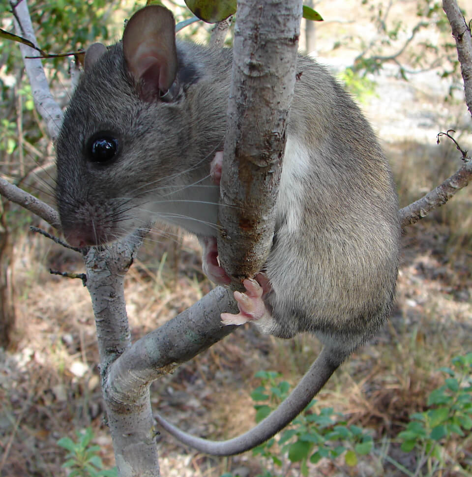

<content-header icon="rodents" title="Key Largo woodrat" subtitle="Neotoma floridana smalli"></content-header>

<figcaption>Photo: USFWS</figcaption>

### Overall vulnerability:

High to Very High

### Conservation status:

Federally Endangered

## General Information

This midsized rodent can reach a body length of up to 16 inches.  Key Largo woodrats have brown-black backs with reddish undertones on the sides and short tails relative to their body size.  Endemic to Key Largo, Florida, this woodrat forages for a diet of mushrooms, berries, seeds and leaves and builds stick nests at the base of trees or stumps.  Key Largo woodrats nest throughout the year with a peak season in the winter.

## Habitat Requirements

The Key Largo woodrat inhabits tropical hardwood hammock habitats within its small geographic range.

**TODO: habitat crosslinks**

## Climate Impacts

The Key Largo woodrat is highly susceptible to sea level rise.  Additionally, this species faces many of the same existing threats common to coastal or island species: habitat loss and degradation from coastal development, barriers to migration, habitat disturbance from recreational use and high mortality from non-native predators.  Competition with black rats is also a serious current threat to this species with the potential to worsen under climate change.

[More information about general climate impacts to species in Florida](/impacts/species).

## Vulnerability Assessment(s)

The overall vulnerability level (High to Very High) was based on the following assessment(s).
#### 

<h3><a href="/impacts/vulnerability/sivva/species">Standardized Index of Vulnerability and Value Assessment</a></h3>

Extremely vulnerable

 

The primary factors contributing to vulnerability of the Key Largo woodrat are sea level rise, presence of barriers, habitat fragmentation, changes in salinity, and runoff and storm surge

## Adaptation Strategies

- Conservation of existing habitat will allow the Key Largo woodrat the best chance of recovering and maintaining a healthy population as climate change begins to accelerate.  This includes controlling existing stressors, such as reducing populations of non-native predators.

- As sea level rise may eventually become too great a threat for the Key Largo woodrat in its current habitat, developing and maintaining a captive breeding population is a strategy to consider for this endemic subspecies.

[More information about adaptation strategies](/strategies).

## Additional Resources

- [Florida Fish and Wildlife Conservation Commission Species Profile](https://myfwc.com/wildlifehabitats/profiles/mammals/land/key-largo-woodrat/)

- [Multi-Species Recovery Plan for South Florida](https://ecos.fws.gov/docs/recovery_plan/sfl_msrp/SFL_MSRP_Species.pdf)
