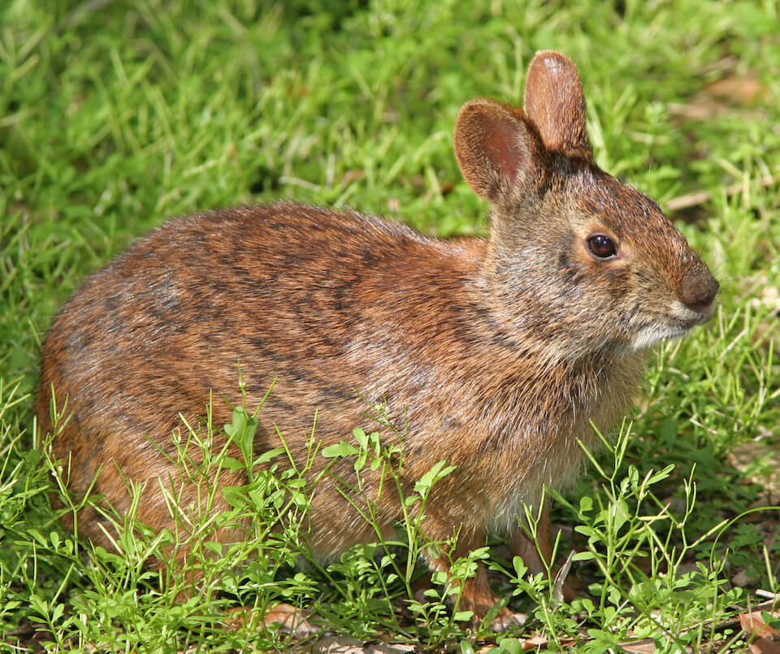

<content-header icon="small_mammals" title="Marsh rabbit" subtitle="Sylvilagus palustris"></content-header>

<figcaption><a href="https://commons.wikimedia.org/w/index.php?curid=6640258" target="_blank" rel="noopener noreferrer">Photo: Tomfriedel</a></figcaption>

### Overall vulnerability:

Moderate

### Conservation status:

Not Listed

## General Information

This small dark brown rabbit is found throughout Florida.  It lacks the fluffy white tail of the more common, eastern cottontail rabbit.  Marsh rabbits have small gray-brown tails.  The marsh rabbit eats a varied diet of herbaceous plants found in and around wetlands.  Marsh rabbits breed year-round with a peak season in the wintertime when they built nests of grass and fur for their young.  The drive to parent is strong in this species- females with go through a pseudo-pregnancy if they mate with an infertile male.  As do many small mammals, these marsh rabbits follow a fast reproductive cycle.  Females will often have 6-7 litters per year and once born, offspring are self-reliant at only 12-15 days.

## Habitat Requirements

Strong swimmers, marsh rabbits are usually found close to water.  Glades marsh and mangroves are typical habitat types associated with the species.

**TODO: habitat crosslinks**

**TODO: habitat map (if exists)**

## Climate Impacts

The marsh rabbit faces substantial threats related to climate change.  First, sea level rise is a grave impending threat to the rabbit’s coastal habitat.  Hurricanes, storm surge events and flooding can be treacherous for young nestlings.  Additionally, this species faces many of the same existing threats common to coastal species: habitat loss and degradation from coastal development, barriers to migration, habitat disturbance from recreational use and high mortality from non-native predators.

[More information about general climate impacts to species in Florida](/impacts/species).

## Vulnerability Assessment(s)

The overall vulnerability level (Moderate) was based on the following assessment(s).
#### 

<h3><a href="/impacts/vulnerability/ccvi">Climate Change Vulnerability Index</a></h3>

Moderately vulnerable

 

Marsh rabbits are found in close proximity to water in a variety of habitats, including salt marsh, freshwater marsh, wet prairie, coastal beach berms, mangrove swamps, hammocks, sugarcane and other agricultural fields, lake margins and vegetation along canals, ditches, and roadsides. Coastal and low lying freshwater marsh ecosystems will be vulnerable to sea level rise. However, there is some uncertainty about the relative importance of coastal habitat versus interior habitat for this species (outside of the Keys).  Therefore, sea level rise was seen as  "neutral" to "somewhat increases" vulnerability. Increased fire could potentially increase habitat availability by promoting herbaceous growth and limiting woody encroachment, provided there is sufficient moisture to support regrowth and sufficient unburned habitat to provide cover.  The peninsular population is identified as potentially shifting range in response to climate change, indicating that the species may have the potential to track changing climate.

## Adaptation Strategies

- Conservation of existing habitat including partnering with other organizations to reach mutual goals in restoration efforts is an important step in maintaining a healthy population as climate change begins to accelerate.

- Conserving healthy future marsh and mangrove habitats as sea levels rise and human communities begin to shift is important for this species.

- Protecting migratory corridors if mangrove habitat migrates inland and northward is an important adaptation strategy for this species.  Assisted migration to optimal habitat removed from the rabbit’s range in a future climate is a possible strategy.

[More information about adaptation strategies](/strategies).

## Additional Resources

- [Florida Fish and Wildlife Conservation Commission Species Profile](https://myfwc.com/wildlifehabitats/profiles/mammals/land/marsh-rabbit/)
