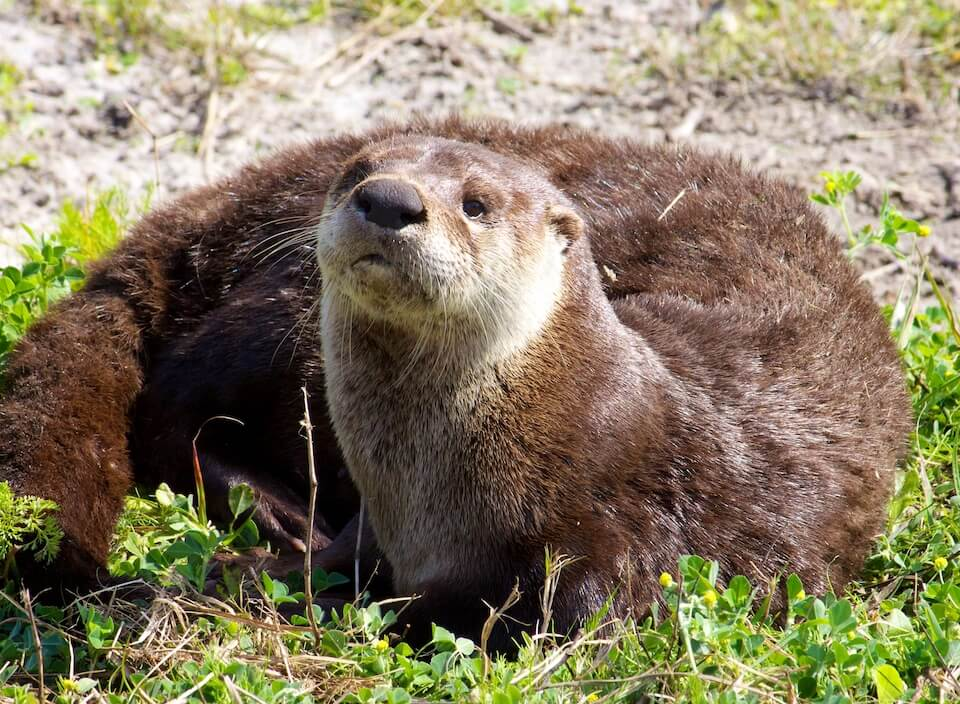

<content-header icon="small_mammals" title="River otter" subtitle="Lontra canadensis">
</content-header>

<figcaption>Photo: USFWS</figcaption>

### Overall vulnerability:

Very Low

### Conservation status:

Species of Greatest Conservation Need

## General Information

Playful and beloved, river otters are adapted for land and water with their short legs, webbed toes and strong, flattened tails.  River otters are found throughout Florida, except for the Keys.  These mammals are primarily nocturnal, becoming active at night as they forage for crayfish and fish.  Otters den in burrows found on the banks of waterbodies, sometimes making use of abandoned beaver burrows rather than digging their own.

## Habitat Requirements

River otters inhabit a range of freshwater habitats in Florida, including rivers, creeks, lakes, ponds and swamps.

**TODO: habitat crosslinks**

## Climate Impacts

With a currently stable population, high genetic diversity and strong dispersal ability, river otters may be able adapt to many climate-driven changes. However, their preference for fresh water over brackish and saline suggests that river otters may be negatively impacted by sea level rise and salination of freshwater habitat in some parts of their range.  Disturbance events such as strong storms may damage otter habitat and burrows and additional habitat degradation linked to climate change, such as sedimentation, drought and temperature shifts may cause a reduction in the otter’s prey base.

[More information about general climate impacts to species in Florida](/impacts/species).

## Vulnerability Assessment(s)

The overall vulnerability level (Very Low) was based on the following assessment(s).
#### 

<h3><a href="/impacts/vulnerability/ccvi">Climate Change Vulnerability Index</a></h3>

Not vulnerable   Presumed stable

 

The primary factor contributing to the vulnerability of the river otter is its' dependence on aquatic habitats.  As sea level rises, estuarine habitats will move inland, but it is unclear whether this will create additional habitat or simply result in habitat shifts. Otters are less common in brackish water, so sea level rise would lead to habitat being lost, as well as some becoming unsuitable as they become more brackish.   Several factors contribute to adaptive capacity in this species, such as good dispersal ability and relatively high genetic variation.  Excessive flooding along rivers could destabilize sites used for denning and resting.

## Adaptation Strategies

- Restoration of existing river and riparian habitat at the onset of climate change may increase otter resilience to additional impacts.

- Monitoring natural community shifts to prioritize areas for conservation is an important first step in ensuring river otter habitat can be conserved in a future climate.  Since sea level rise may cause salination of many current areas of freshwater habitat, monitoring can help conservationists get ahead of climate-driven shifts and understand where to best focus their efforts.

[More information about adaptation strategies](/strategies).

## Additional Resources

- [Florida Fish and Wildlife Conservation Commission Species Profile](https://myfwc.com/wildlifehabitats/profiles/mammals/aquatic/river-otter/)
