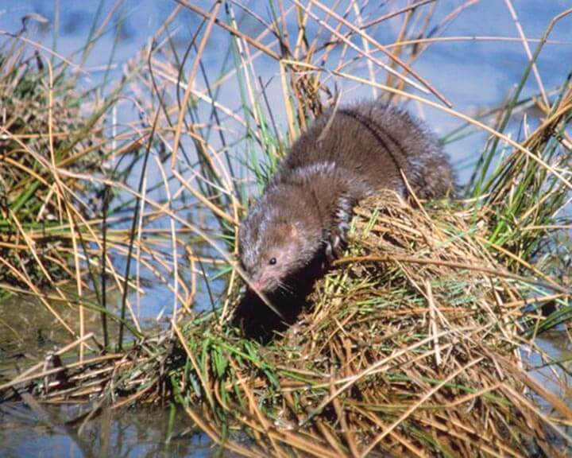

# Everglades mink

### Neovison vison evergladensis

<figcaption>Photo: Florida Wildlife Magazine</figcaption>

### Overall vulnerability:

Low

### Conservation status:

State Threatened

## General Information

This midsized weasel has silky dark brown fur with white spots on the chin and chest.  The Everglades mink is a distinct subspecies of the American mink endemic to south Florida near the Everglades and Big Cypress.  This mink eats a diet of small mammals, snakes and insects.  Everglades minks breed along with the fall rainy season, averaging a litter of about four young per year.

## Habitat Requirements

This mink inhabits shallow Everglades marshes within its narrow range.

**TODO: habitat crosslinks**

**TODO: habitat map (if exists)**

## Climate Impacts

Everglades mink habitat is highly susceptible to sea level rise.  Additionally, this species faces many of the same existing threats common to coastal species in south Florida: habitat loss and degradation from coastal development, barriers to migration, habitat disturbance from recreational use and high mortality from non-native predators, especially Burmese pythons.

[More information about general climate impacts to species in Florida](/impacts/species).

## Vulnerability Assessment(s)

The overall vulnerability level (Low) was based on the following assessment(s).
#### 

<h3><a href="/impacts/vulnerability/sivva/species">Standardized Index of Vulnerability and Value Assessment</a></h3>

Slightly to Moderately vulnerable

 

The primary factors contributing to vulnerability of the Everglades mink are sea level rise, erosion, presence of barriers, habitat fragmentation, runoff and storm surge, and alterations to biotic interactions.

## Adaptation Strategies

- Conservation of existing habitat will allow the Everglades mink the best chance of recovering and maintaining a healthy population as climate change begins to accelerate.  This includes controlling existing stressors, such as reducing populations of non-native predators.

- As sea level rise may eventually become too great a threat for the Everglades mink in its current habitat, developing and maintaining a captive breeding population is a strategy to consider for this endemic subspecies.

[More information about adaptation strategies](/strategies).

## Additional Resources

- [Florida Fish and Wildlife Conservation Commission Species Profile](https://myfwc.com/wildlifehabitats/profiles/mammals/land/everglades-mink/)
