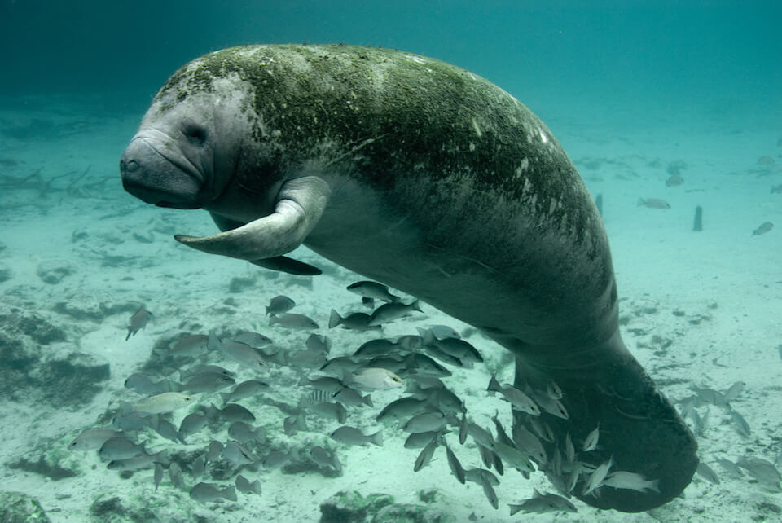

# West Indian manatee

### Trichechus manatus

<figcaption>Photo: USFWS</figcaption>

### Overall vulnerability:

High

### Conservation status:

Federally Threatened

## General Information

The West Indian Manatee’s range extends from the southern United States, through the Caribbean, to northern South America. These enormous and gentle mammals, also referred to as “sea cows,” spend up to a third of their time grazing on aquatic plants and seagrasses. Adult manatees can grow to between 9 and 10 feet and weigh an average of 1,000 pounds. West Indian manatees are semi-social mammals that spend most of the year searching waterways for food, except during the winter months when they gather at warm-water sites. In the wild, manatees typically live between 20 and 30 years and reach sexual maturity at 3-7 years of age.

## Habitat Requirements

The West Indian Manatee is typically found along the coast of the southeastern United States where it prefers warmer waters found in river, stream, and spring habitats, as well as other coastal or brackish areas that supply ample amounts of seagrass.

**TODO: habitat crosslinks**

**TODO: habitat map (if exists)**

## Climate Impacts

Manatees are highly sensitive to temperature and water quality within their habitats.  While many believe manatees will benefit from the warmer water temperatures expected as the climate changes, more extreme conditions including frequently or severe cold snaps could increase manatee mortality.  The manatee is also entirely dependent on its food source, and a decline in the quantity and quality of seagrass linked to climate change could be highly detrimental to the species.  Climate-driven changes in precipitation resulting in increased pollution, water chemistry or dissolved oxygen could also impact the manatee or its habitat.

[More information about general climate impacts to species in Florida](/impacts/species).

## Vulnerability Assessment(s)

The overall vulnerability level (High) was based on the following assessment(s).
#### 

<h3><a href="/impacts/vulnerability/sivva/species">Standardized Index of Vulnerability and Value Assessment</a></h3>

Extremely vulnerable

 

The primary factors contributing to vulnerability of the West Indian manatee are alterations to biotic interactions and synergies with development..

## Adaptation Strategies

- Enhance management practices and monitoring to ensure abundance of seagrasses.  Monitoring is an important adaptation strategy to identify climate trends and impacts quickly and adjust to a more aggressive restoration strategy if neccessary.

- Establishing and maintaining minimum flow levels of Florida springs is important to ensure consistent water quality in manatee habitat as climate change accelerates.

[More information about adaptation strategies](/strategies).

## Additional Resources

- [Florida Fish and Wildlife Conservation Commission Species Profile](https://myfwc.com/wildlifehabitats/profiles/mammals/aquatic/florida-manatee/)

- [Federal Recovery Plan](https://ecos.fws.gov/docs/recovery_plan/011030.pdf)

- [Multi-Species Recovery Plan for South Florida](https://ecos.fws.gov/docs/recovery_plan/sfl_msrp/SFL_MSRP_Species.pdf)
