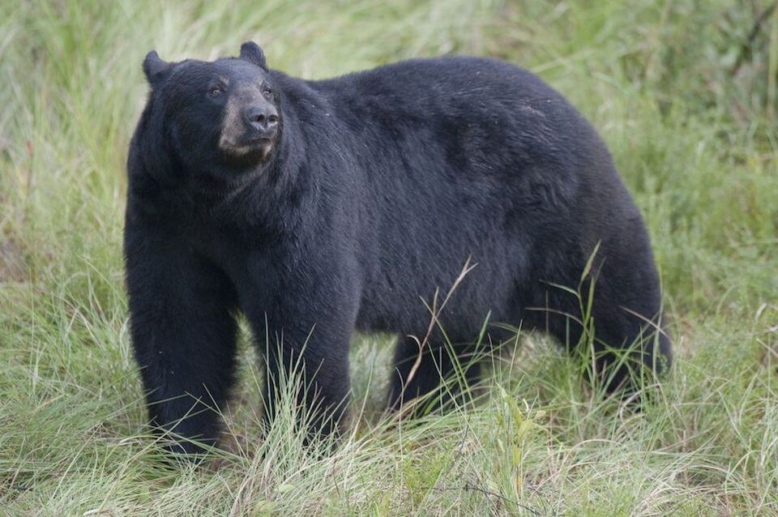

# Florida black bear

### Ursus americanus floridanus

<figcaption>Photo: US Forest Service</figcaption>

### Overall vulnerability:

Low

### Conservation status:

Species of Greatest Conservation Need

## General Information

The only species of bear found in the state, the Florida black bear is large and heavily built with a coat of shiny, black fur.  While Florida black bears once inhabited the entire state including portions of the Florida Keys, the bear’s present range is much more sporadic, with isolated populations occurring in various locations throughout the state.  The historic Florida black bear population declined dramatically prior to 1980 largely due to human expansion and hunting, but conservation efforts over the past several decades have resulted in an increasing Florida black bear population in the state.  With a concurrently increasingly human population pushing into once remote locations in Florida, human encounters with black bears have increased in recent years.  Florida black bears are omnivorous with a diet consisting of plant matter supplemented with insects and occasional carrion.  As are many bear species, Florida black bears are solitary with pairs or groups only commonly observed during the summer mating season.  During the summer months, Florida black bears are more active and go through a period of increased foraging in anticipation of winter denning and nursing cubs.

## Habitat Requirements

**Total habitat within Florida:** 6,643,423 hectares (modeled)

Florida black bears utilize a wide range of forested habitats, preferring dense canopy cover and migratory pathways allowing movement.  Flatwoods, scrub and swamp habitat types all represent ideal bear habitat in Florida.

**TODO: habitat crosslinks**

**TODO: habitat map (if exists)**

## Climate Impacts

The Florida black bear’s ability to thrive in a variety of habitat types makes it less vulnerable to the impacts of climate change than a more specialized species.  However, its reliance on migratory corridors is likely to be a challenge for the species as climate change influences human movement and development patterns.  Human-bear conflict may increase as bear habitat becomes more fragmented in a changing climate.

[More information about general climate impacts to species in Florida](/impacts/species).

#### This species is expected to be impacted by sea level rise:

- 3 meters of sea level rise: 13% of habitat (889,365 ha)
- 1 meter of sea level rise: 6% of habitat (389,142 ha)
    

## Vulnerability Assessment(s)

The overall vulnerability level (Low) was based on the following assessment(s).
#### 

<h3><a href="/impacts/vulnerability/sivva/species">Standardized Index of Vulnerability and Value Assessment</a></h3>

Moderately vulnerable

 

The primary factor contributing to vulnerability of the Florida black bear is alterations to biotic interactions.

## Adaptation Strategies

- Preserving large, connected patches of suitable habitat allowing bears to move freely to find the most suitable habitat in a changing landscape is the most important adaptation strategy for the Florida black bear.

[More information about adaptation strategies](/strategies).

## Additional Resources

- [Florida Fish and Wildlife Conservation Commission Species Profile](https://myfwc.com/wildlifehabitats/profiles/mammals/land/black-bear/)
