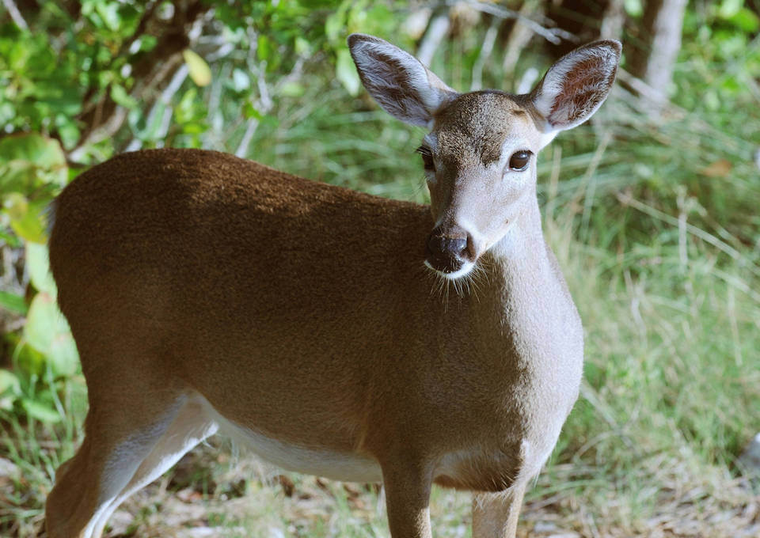

# Key deer
### *Odocoileus virginianus clavium*

**Conservation status:** Federally Endangered

**TODO:vulnerability**

The smallest subspecies of white-tailed deer, Key deer are found only the Florida Keys.  Key deer can swim between islands of the archipelago and their current range extends from Big Pine Key to Sugarloaf Key, reduced from their historical range spanning most of the Keys.  Habitat destruction and hunting decimated the Key deer population in the 1940s, with numbers falling to less than 50 individuals.  The current population has recovered to approximately 800 individuals.  Key deer are beloved and iconic in their native home.  As land area is limited in the Florida Keys, the Key deer is well adapted to tolerate sharing space with human.  In many areas, Key deer can be seen wandering in neighborhoods and other developed areas.

    
## Habitat Requirements

Key deer use all available habitats found within their range including areas populated by humans.  Pine rockland communities, unique pine flatwoods found exclusively on limestone substrate in southern Florida and the Keys, provide particularly critical habitat as they contain essential permanent freshwater sources.

## Climate Impacts

The Key deer is highly vulnerable to habitat loss stemming from sea level rise and land use change.  Limited by open water barriers preventing migration off the Florida Keys, Key deer are expected to lose 32-75% of useable habitat to sea level rise.  In addition to the direct threat of displacement, sea level rise will lead to increased salinity of freshwater drinking sources, a primary limiting resource for Key deer.  Drought, shifting hydrological conditions brought on by changes in precipitation patterns, and strong storm surge events may further increase salinization of freshwater sources.  Non-climate-related threats such as habitat fragmented by human development, highway mortality and the spread of disease and parasites linked to illegal feeding are also significant for this species.

## Adaptation Strategies

- Securing the availability of permanent, freshwater sources is an important adaptation strategy for the Key deer.  Gradual salination of freshwater sources due to sea level rise and immediate infiltration of saltwater into freshwater reserves following a storm event are both concerns for this species.

- While implementing an appropriate fire regime is extremely difficult in the Florida Keys, prescribed fire to the extent possible in combination with other maintenance techniques such as mechanical thinning is important to conserve the Key deer’s pine rockland habitat.

- As a subspecies inhabiting an island location highly vulnerable to sea level rise, assisted migration to an area where interbreeding with mainland whitetail deer is not possible or establishment of a captive breeding program is a long-term adaptation strategy.

[More information about adaptation strategies](/strategies).

## Additional Resources

- [Multi-Species Recovery Plan for South Florida](https://ecos.fws.gov/docs/recovery_plan/sfl_msrp/SFL_MSRP_Species.pdf)
