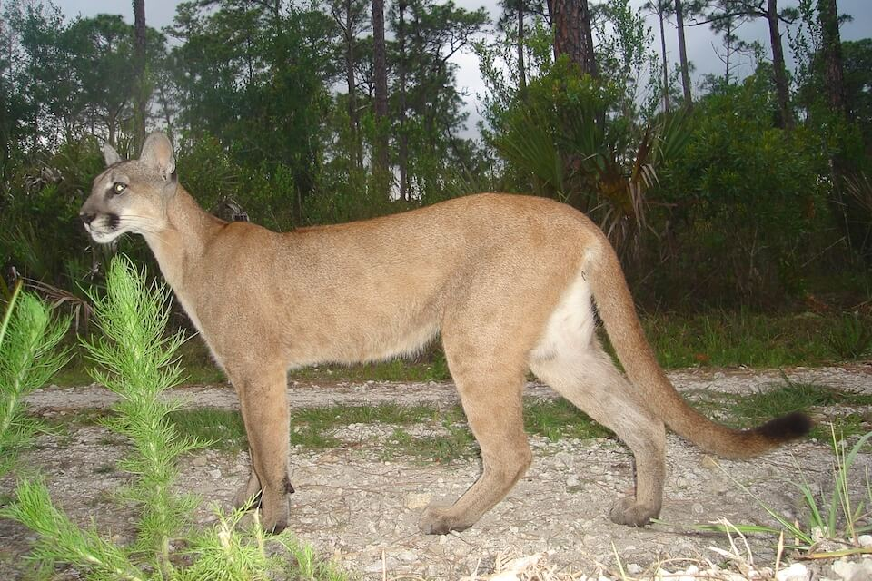

# Florida panther

### Puma concolor coryi

<figcaption>Photo: USFWS/FWC</figcaption>

### Overall vulnerability:

Moderate

### Conservation status:

Federally Endangered

## General Information

While the Florida panther’s historic range once extended from Florida to Louisiana and throughout the Gulf states, today the large cat occupies only 5 percent of that range.  A population of approximately 120-230 adult panthers is now limited primarily to southern Florida, south of the Caloosahatchee River.  Florida panthers are the larger of Florida’s two native cat species (panthers and bobcats.  The panther’s prey base consists of small and large mammals, reptiles, and birds.  Kittens remain with their mother for up to two years in the wild, hunting alongside of her before venturing off on their own.

## Habitat Requirements

**Total habitat within Florida:** 1,446,866 hectares (modeled)

Panthers utilize a variety of habitat types including hardwood forests, prairies and swamps.  These solitary and territorial creatures are habitat generalists partly due to their need for ample space.  Males require approximately 200 square miles, while females require about 75 square miles.

**TODO: habitat crosslinks**

**TODO: habitat map (if exists)**

## Climate Impacts

Florida panther habitat is concentrated inland so does not tend to be directly impacted by sea level rise.  However, habitat fragmentation and encroachment by humans are two of the biggest driving forces in reducing the panther population from historical to current levels.  Roadside mortality is currently the leading cause of panther death in the wild.  As coastal inundation from sea level rise occurs, resulting increases in human development within panther habitat could greatly exacerbate current stressors.  Changes in climate and subsequent development patterns could also further compromise the feasibility of critical prescribed fire management in panther habitat.

[More information about general climate impacts to species in Florida](/impacts/species).

#### This species is expected to be impacted by sea level rise:

- 3 meters of sea level rise: 24% of habitat (349,094 ha)
- 1 meter of sea level rise: 8% of habitat (117,155 ha)

[More information about sea level rise impacts on species in Florida](/impacts/species/slr).
    

## Vulnerability Assessment(s)

The overall vulnerability level (Moderate) was based on the following assessment(s).
#### 

<h3><a href="/impacts/vulnerability/ccvi">Climate Change Vulnerability Index</a></h3>

Not vulnerable   Presumed stable

 

Factors that are identified as contributing to vulnerability of the Florida panther include potentially incompatible human responses to climate change, changes in fire regime that might reduce the availability of resting and denning sites, and genetic variability. The area of occupancy may be reduced due to a shift of the human population further inland in response to sea level rise.  Between 5-10% of the species' range is expected to be impacted by a 1-meter sea level rise.  Increased fire could increase forage for deer, thereby increasing prey availability. However, fire may also reduce the availability of daytime resting sites and available den sites in thick vegetation.

#### 

<h3><a href="/impacts/vulnerability/sivva/species">Standardized Index of Vulnerability and Value Assessment</a></h3>

Extremely vulnerable

 

The primary factors contributing to vulnerability of the Florida panther are sea level rise, presence of barriers, habitat fragmentation, changes in salinity and runoff and storm surge.

## Adaptation Strategies

- Preserving large, connected patches of suitable habitat allowing panthers to move freely to find the most suitable habitat in a changing landscape is the most important adaptation strategy for the Florida panther.

- Monitoring and maintaining healthy panther populations throughout the cat’s current range to bolster resilience is an important first step in adapting to a changing climate.

[More information about adaptation strategies](/strategies).

## Additional Resources

- [Florida Fish and Wildlife Conservation Commission Species Profile](https://myfwc.com/wildlifehabitats/profiles/mammals/land/florida-panther/)

- [Federal Recovery Plan](https://ecos.fws.gov/docs/recovery_plan/081218.pdf)

- [Multi-Species Recovery Plan for South Florida](https://ecos.fws.gov/docs/recovery_plan/sfl_msrp/SFL_MSRP_Species.pdf)
