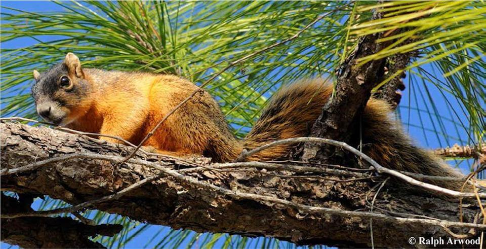

# Big Cypress fox squirrel

### Sciurus niger avicennia

<figcaption>Photo: Ralph Arwood</figcaption>

### Overall vulnerability:

Moderate

### Conservation status:

State Threatened

## General Information

The Big Cypress fox squirrel is large in relation to other species and can be identified by its black head and back, cream-colored sides and belly, and prominent dark, bushy tail.  Relatively little is known about this secretive subspecies of fox squirrel inhabiting a limited South Florida range.  Big Cypress fox squirrels rely on a diet of nuts, seeds, fungi and fruit with the occasional foray into animal matter such as insects and eggs. Big Cypress fox squirrels are prolific breeders and can reproduce throughout the year, with most breeding occurring during the winter and spring months.

## Habitat Requirements

**Total habitat within Florida:** 146,804 hectares (modeled)

Big Cypress fox squirrels are primarily ground-dwelling and occur within a range of habitat types in their narrow Southern Florida distribution.  They inhabit stands of savanna, hardwood and swamp lands as well as suburban habitat such as golf courses and parks.

**TODO: habitat crosslinks**

**TODO: habitat map (if exists)**

## Climate Impacts

The Big Cypress fox squirrel is vulnerable to sea level rise directly as well as the increased habitat fragmentation and barriers to migration linked to rising seas in highly developed South Florida.  This species also depends on fire-maintained habitat.  As optimal prescribed burn conditions are likely to become less frequent as climate change accelerates, increased fire suppression is likely to contribute to habitat degradation.

[More information about general climate impacts to species in Florida](/impacts/species).

#### This species is expected to be impacted by sea level rise:

- 3 meters of sea level rise: 38% of habitat (55,885 ha)
- 1 meter of sea level rise: 7% of habitat (10,642 ha)

[More information about sea level rise impacts on species in Florida](/impacts/species/slr).
    

## Vulnerability Assessment(s)

The overall vulnerability level (Moderate) was based on the following assessment(s).
#### 

<h3><a href="/impacts/vulnerability/sivva/species">Standardized Index of Vulnerability and Value Assessment</a></h3>

Moderately vulnerable

 

The primary factors contributing to vulnerability of the Big Cypress fox squirrel are sea level rise, presence of barriers, habitat fragmentation, runoff and storm surge, and alterations to biotic interactions and disturbance regimes.

## Adaptation Strategies

- Implementing an appropriate fire regime for as long as possible will increase habitat resilience to climate change.  Alternative conservation management methods to use when fire is not possible should also be explored.

- Given the high degree of habitat fragmentation already present within the squirrel’s range, protecting connected patches of habitat wherever possible should be prioritized.

- The Big Cypress fox squirrel’s tolerance of suburban habitat may be an adaptation advantage as climate change begins to drive shifts in human development patterns.  Connecting patches of suitable suburban habitat is another possible strategy.

[More information about adaptation strategies](/strategies).

## Additional Resources

- [Florida Fish and Wildlife Conservation Commission Species Profile](https://myfwc.com/wildlifehabitats/profiles/mammals/land/big-cypress-fox-squirrel/)
