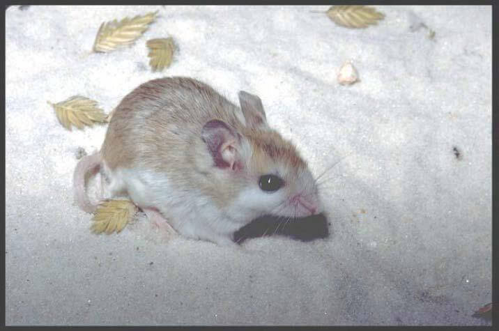

# Choctawhatchee beach mouse

### Peromyscus polionotus allophrys

### Overall vulnerability:

Moderate to High

### Conservation status:

Federally Endangered

## General Information

The Choctawhatchee beach mouse is an old-field mouse with a light brown back and a white belly.  These small rodents reach a body length of about 14 centimeters and are limited to a small range in the western panhandle of Florida extending from Choctawhatchee Bay to St. Andrew Bay.  Choctawhatchee beach mice are monogamous and can breed year-round with adequate food supply.  They exhibit the rapid gestation cycle characteristic of many small mammals – pups are weaned at 18 days after birth and reach sexual maturity at only 30 days.  Females are capable of breeding only 24 hours after giving birth.

## Habitat Requirements

**Total habitat within Florida:** 972 hectares (modeled)

The Choctawhatchee beach mouse is found primarily in isolated sand dunes habitats on conservation lands within their limited range.  Beach mice are nocturnal and emerge from their sandy burrows at night to forage on a diet of seeds, dune plants and insects.

**TODO: habitat crosslinks**

**TODO: habitat map (if exists)**

## Climate Impacts

The Choctawhatchee beach mouse is highly vulnerable to the impacts of sea level rise given its small range and dependence on fragile beach dune habitat.  Increased intensity of storm events and subsequent coastal erosion and flooding is likely to result in habitat loss and fragmentation for the beach mouse before complete inundation from sea level rise occurs.

[More information about general climate impacts to species in Florida](/impacts/species).

#### This species is expected to be impacted by sea level rise:

- 3 meters of sea level rise: 68% of habitat (659 ha)
- 1 meter of sea level rise: 33% of habitat (321 ha)

[More information about sea level rise impacts on species in Florida](/impacts/species/slr).
    

## Vulnerability Assessment(s)

The overall vulnerability level (Moderate to High) was based on the following assessment(s).
#### 

<h3><a href="/impacts/vulnerability/sivva/species">Standardized Index of Vulnerability and Value Assessment</a></h3>

Highly vulnerable

 

The primary factors contributing to vulnerability of the Choctawhatchee beach mouse  are sea level rise, habitat fragmentation, changes in salinity, runoff and storm surge, and alterations to disturbance regimes. This species is already extirpated on non-protected lands.

## Adaptation Strategies

- Conservation and management of current habitat, including restoring vegetation and maintaining an early successional community will be a key strategy to improve habitat resilience to disturbance events as climate change accelerates.

- As sea level rise poses a grave threat to the long-term success of the Choctawhatchee beach mouse, assisted migration and development of a captive breeding program are long-term strategies to consider.

[More information about adaptation strategies](/strategies).

## Additional Resources

- [Florida Fish and Wildlife Conservation Commission Species Profile](https://myfwc.com/wildlifehabitats/profiles/mammals/land/choctawhatchee-beach-mouse/)

- [Federal Recovery Plan](https://ecos.fws.gov/docs/recovery_plan/870812.pdf)
