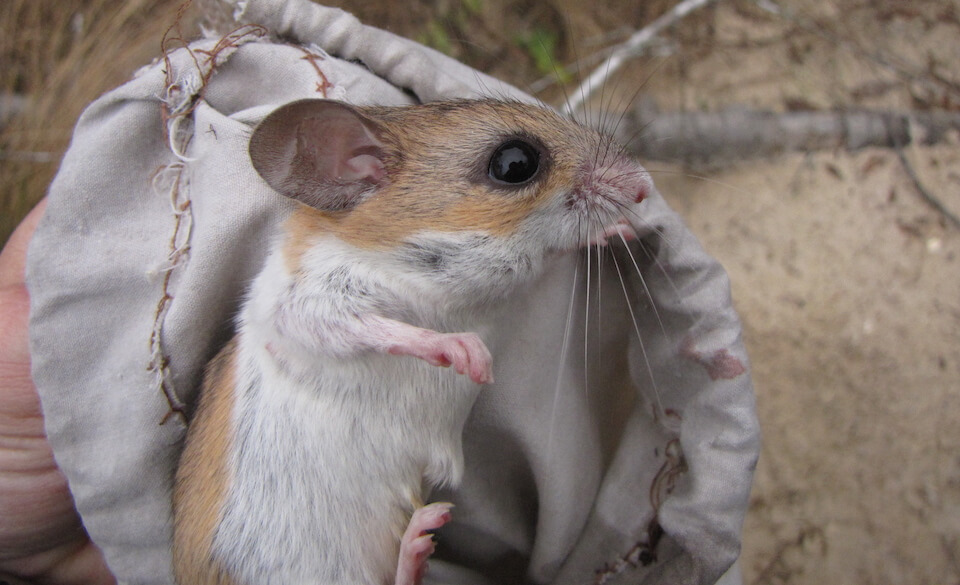

# Florida mouse
### *Podomys floridanus*

**Conservation status:** Species of Greatest Conservation Need

**TODO:vulnerability**

The Florida mouse is a large, tan colored rodent that inhabits the northern two thirds of the Florida panhandle.  It is distinguished by its unusual feet – the Florida mouse has five foot pads on each of its feet.  This mouse is one of the many Florida species to make use of gopher tortoise burrows by digging smaller burrows for itself extending from within the larger burrows to nest in.  The Florida mouse nests and reproduces throughout the year with a peak season in the fall and winter.  It forages on seeds, plants, fungi and insects.

    
## Habitat Requirements

The Florida mouse inhabits the well-drained upland habitat of central Florida including high pine and scrub, flatwoods, and sandhill.

## Climate Impacts

The Florida mouse is likely to be impacted by climate change primarily through alteration and loss of habitat.  Rising temperatures, shifting precipitation patterns and altered fire regimes are likely to alter community structure in the Florida mouse’s dry inland habitat over time.  Spreading invasive plant species in a changing climate could also change community composition, resulting in increasingly fragmented habitat.  As a species that relies on gopher tortoise burrows, the Florida mouse is likely to be negatively impacted if gopher tortoise populations decline in response to climate-related threats as well.

## Adaptation Strategies

- Implementing an appropriate fire regime is an important adaptive management strategy for the Florida mouse.  Climate change is likely to make prescribed fire more challenging as optimal burning conditions become increasingly rare, thus implementing a consistent fire management regime early is crucial.

- As controlled burning becomes more challenging in a changing climate, other habitat management strategies such as mechanical thinning may need to be pursued to maintain optimal habitat.

- Controlling existing threats not directly related to climate change, such as habitat loss and fragmentation, is an important first-step adaptation strategy for the Florida mouse.

[More information about adaptation strategies](/strategies).

## Additional Resources

- [FWC Imperiled Species Management Plan (ISMP)](http://myfwc.com/media/4133167/Floridas-Imperiled-Species-Management-Plan-2016-2026.pdf)

- [FWC Biological Status Review](http://www.myfwc.com/media/2273304/Florida-Mouse-BSR.pdf)

- [FWC Species Action Plan](http://myfwc.com/media/2738819/Florida-Mouse-Species-Action-Plan-Final-Draft.pdf)
