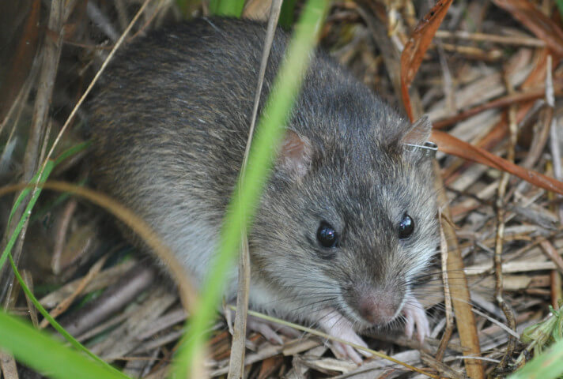

# Sanibel Island rice rat

### Oryzomys palustris sanibeli

<figcaption>Photo: USFWS</figcaption>

### Overall vulnerability:

Low to Moderate

### Conservation status:

State Threatened

## General Information

The Sanibel Island rice rat is a subspecies of the rice rat endemic to Sanibel Island, Florida.  This species has a brown back and a cream-colored belly and can reach an approximate length of 10 inches.  Rice rats are primarily nocturnal and will spend their evening hours foraging for insects, crabs, snails and plants throughout their large home ranges.  This species breeds throughout the year and has a short reproductive cycle – juveniles reach maturity at about 50 days and wild rice rats typically live for less than one year.

## Habitat Requirements

**Total habitat within Florida:** 644 hectares (modeled)

The Sanibel Island rice rat is semi-aquatic and inhabits coastal and freshwater marshes, swamps, and hammocks on Sanibel Island.

**TODO: habitat crosslinks**

**TODO: habitat map (if exists)**

## Climate Impacts

This endemic subspecies is currently highly threatened by habitat loss and degradation, predation by feral cats, and fire suppression made necessary by nearby urbanization.  These existing threats coupled with extremely high vulnerability to sea level rise, make it likely that the Sanibel Island rice rat will be significantly impacted by climate change.  Additionally, this species is restricted from migration due to the geographic barriers of its island home and its genetic similarity to the mainland species of rice rat.  If Sanibel Island rats expanded beyond their limited range, they would likely be genetically swamped by similar mainland rats.

[More information about general climate impacts to species in Florida](/impacts/species).

#### This species is expected to be impacted by sea level rise:

- 3 meters of sea level rise: 100% of habitat (644 ha)
- 1 meter of sea level rise: 100% of habitat (644 ha)

[More information about sea level rise impacts on species in Florida](/impacts/species/slr).
    

## Vulnerability Assessment(s)

The overall vulnerability level (Low to Moderate) was based on the following assessment(s).
#### 

<h3><a href="/impacts/vulnerability/sivva/species">Standardized Index of Vulnerability and Value Assessment</a></h3>

Moderately vulnerable

 

The primary factors contributing to vulnerability of the Sanibel Island rice rat are sea level rise, presence of barriers, minimal habitat protection, habitat fragmentation, changes in salinity, runoff and storm surge, and alterations to biotic interactions.

## Adaptation Strategies

- Conservation of existing habitat will allow the Sanibel Island rice rat the best chance of recovering and maintaining a healthy population as climate change begins to accelerate.

- As sea level rise may eventually become too great a threat for the Sanibel Island rice rat in its current habitat and range, developing and maintaining a captive breeding population and assisted migration to a new location absent of similar rice rats are strategies to consider for this species.

- Controlling existing threats such as feral cats is an important first-step in increasing rice rat population resilience and ability to adapt.

[More information about adaptation strategies](/strategies).

## Additional Resources

- [Florida Fish and Wildlife Conservation Commission Species Profile](https://myfwc.com/wildlifehabitats/profiles/mammals/land/sanibel-island-rice-rat/)
