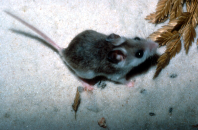

# Perdido Key beach mouse

### Peromyscus polionotus trissyllepsis

<figcaption><a href="https://commons.wikimedia.org/w/index.php?curid=2434079" target="_blank" rel="noopener noreferrer">Photo: Legionarius</a></figcaption>

### Conservation status:

Federally Endangered

### Overall vulnerability:

Very High

Relatively little is known about the Perdido Key beach mouse, a subspecies of the small old-field mouse, now endemic only to Perdido Key, Florida.  The small, pale colored mouse blends in well with the white sand beaches of its Gulf coast habitat. The Perdido Key beach mouse is dependent on dune habitat for food and shelter, burrowing under dune vegetation and eating a diet primarily of sea oat seeds.   The species is monogamous and has the fast-reproductive cycle common of small mammals.  Breeding season typically occurs during the early winter months but can continue year-round in optimal food and climate conditions.

## Habitat Requirements

The Perdido Key beach mouse relies exclusively on sand dune habitat vegetated by sea oats.

**TODO: habitat crosslinks**

**TODO: habitat map (if exists)**

## Climate Impacts

As an endangered sub-species endemic to an island, the Perdido Key beach mouse faces substantial threats related to climate change.  First, sea level rise is a grave impending threat to the beach mouse’s island habitat.  Additionally, this species faces many of the same existing threats common to coastal or island species: habitat loss and degradation from coastal development, barriers to migration, habitat disturbance from recreational use and high mortality from non-native predators.  These existing threats are likely to be magnified by the increasingly severe storm events and shifting conditions of a changing climate.

[More information about general climate impacts to species in Florida](/impacts/species).

## Vulnerability Assessment(s)

The overall vulnerability level (Very High) was based on the following assessment(s).
#### 

<h3><a href="/impacts/vulnerability/sivva/species">Standardized Index of Vulnerability and Value Assessment</a></h3>
<b class="extreme">Extremely vulnerable</b>

 

The primary factors contributing to vulnerability of the Perdido Key beach mouse are sea level rise, erosion, presence of barriers, minimal habitat protection, habitat fragmentation, runoff and storm surge, and alterations to biotic interactions.

## Adaptation Strategies

- Conservation of existing beach habitat will allow the Perdido Key beach mouse the best chance of recovering and maintaining a healthy population as climate change begins to accelerate.  This includes controlling existing stressors, such as reducing populations of non-native predators.

- As sea level rise may eventually become too great a threat for the Perdido Key beach mouse in its current habitat, developing and maintaining a captive breeding population is a strategy to consider for this island endemic subspecies.

[More information about adaptation strategies](/strategies).

## Additional Resources

- [Florida Fish and Wildlife Conservation Commission Species Profile](https://myfwc.com/wildlifehabitats/profiles/mammals/land/perdido-key-beach-mouse/)

- [Federal Recovery Plan](https://ecos.fws.gov/docs/recovery_plan/870812.pdf)
