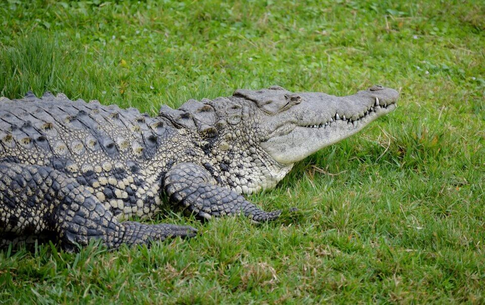

<content-header icon="crocodilians" title="American crocodile" subtitle="Crocodylus acutus">
</content-header>

<figcaption>Photo: Agsftw</figcaption>

### Overall vulnerability:

Moderate

<h3>Habitat area: 
<a href="/species/reptiles/100/map" style="float:right;font-size:smaller;margin-right: 2rem;">
<fa-icon name="map"></fa-icon>
explore on map
</a>
</h3>

-   76,784 hectares within Florida (modeled)

### Conservation status:

Federally Threatened

## General Information

This reclusive reptile inhabits coastal areas throughout the Caribbean with a range limited to Puerto Rico and southern Florida within the United States.  Crocodiles are similar in appearance to the more common American alligator but are lighter in color and have longer, more pointed V-shaped snouts.  Like alligators, crocodiles are ectotherms and must control their body temperature by basking in the sun for warmth or moving to cooler areas.  Crocodiles are top predators and are non-discriminatory in diet, taking any aquatic or terrestrial prey they are capable of capturing based on their body size.

## Habitat Requirements

American crocodiles prefer coastal saltwater or brackish areas including the ponds or creeks of mangrove swamps but can also be found in inland freshwater bodies accessed through canals.

## Climate Impacts

American crocodile habitat is expected to become significantly inundated from even the most conservative estimates (one meter) of sea level rise.  Under various sea level rise scenarios, 30 – 98% of current crocodile habitat will be inundated.  Although new habitat may also become available as the sea levels rise, developed areas may create barriers to northward migration of mangroves and crocodile habitat.  Sea level rise will also drive changes in water chemistry and salinity that may negatively impact current crocodile habitat even before inundation occurs.  Changes in temperature including direct mortality from cold snaps are also a potential threat.  As crocodiles have temperature-dependent sex determination, altered sex ratios under changing temperature conditions are a major concern.

[More information about general climate impacts to species in Florida](/impacts/species).

#### This species is expected to be impacted by sea level rise:

- 3 meters of sea level rise: 100% of area (76,749 ha)
- 1 meter of sea level rise: 100% of area (76,749 ha)

[Explore sea level rise impacts map](/species/reptiles/100/map).

## Vulnerability Assessment(s)

The overall vulnerability level (Moderate) was based on the following assessment(s).
#### 

<h3><a href="/impacts/vulnerability/ccvi">Climate Change Vulnerability Index</a></h3>

Extremely vulnerable

 

The major factors contributing to the vulnerability to climate change for the American crocodile include sea level rise, anthropogenic barriers that may inhibit the species ability to track climatic shifts, changes in the timing/intensity of hurricanes that might impact nest success, changes to hydrology that might affect salinity, and the potential for lower than average genetic variability.  Approximately 90% of the species' nesting habitat is expected to be impacted by a 1-meter sea level rise.  Developed areas, such as Miami, Fort Lauderdale, and Naples, and roads are anthropogenic barriers impacting this species. Shoreline hardening is a potential factor having a negative impact on the availability of nesting habitat.  This species is sensitive to changes in temperatures affecting nest substrate through impacts on offspring sex ratios.  A major source of uncertainty is related to the impact of higher salinities on juveniles in nursery habitat. Decreased soil moisture may also have a potential negative impact on egg incubation and development.  Increased hurricane intensity may lead to increased wind and overwash erosion of nesting sites.  The potential for increased frequency of cold snaps could result in increased direct mortality.

#### 

<h3><a href="/impacts/vulnerability/sivva/species">Standardized Index of Vulnerability and Value Assessment</a></h3>

Moderately vulnerable

 

The primary factors contributing to vulnerability for the American crocodile are sea level rise, erosion, changes in salinity, and runoff and storm surge, and synergies with development.

## Adaptation Strategies

- Monitoring crocodile populations and nesting success is an important first step in identifying early impacts from climate-driven stressors and determining when further intervention is necessary.

- If nesting and nursery habitat becomes degraded or sex ratios are impacted by rising temperatures, artificially created or altered nesting or nursery habitat to maintain nesting success and optimal sex ratios is a possible adaptation strategy.  For example, shade structures could be added to nesting sites to improve the likelihood of achieving balanced sex ratios.

- Additional research aimed at better understanding and modeling expected changes to vegetation and mangrove habitat will improve conservationists’ ability to prioritize key areas on which to focus efforts as climate change accelerates.

[More information about adaptation strategies](/strategies).

## Additional Resources

- [Florida Fish and Wildlife Conservation Commission Species Profile](https://myfwc.com/wildlifehabitats/profiles/reptiles/alligator/)

- [Multi-Species Recovery Plan for South Florida](https://ecos.fws.gov/docs/recovery_plan/sfl_msrp/SFL_MSRP_Species.pdf)
