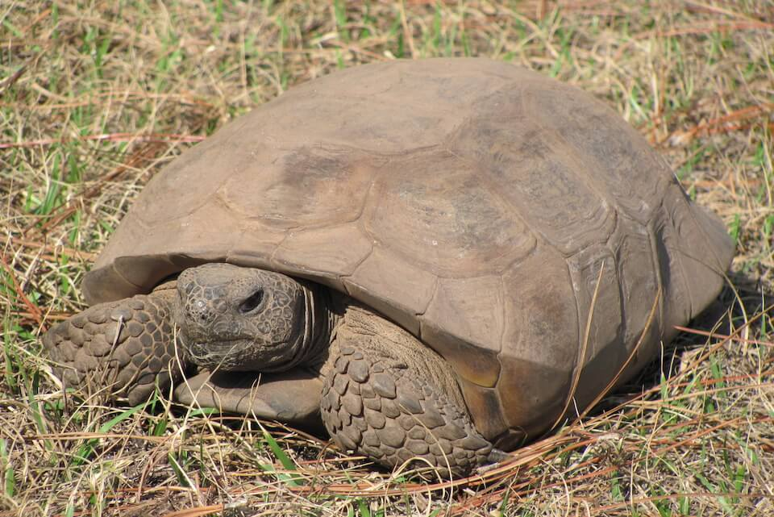

<content-header icon="turtles" title="Gopher tortoise" subtitle="Gopherus polyphemus">
</content-header>

<figcaption>Photo: FWC</figcaption>

### Overall vulnerability:

Moderate

<h3>Habitat area: 
<a href="/species/reptiles/129/map" style="float:right;font-size:smaller;margin-right: 2rem;">
<fa-icon name="map"></fa-icon>
explore on map
</a>
</h3>

-   1,946,128 hectares within Florida (modeled)

### Conservation status:

State Threatened

## General Information

This ancient species of land-dwelling turtle is the only North American tortoise that occurs east of the Mississippi River.  These long-living, slow-growing reptiles eat low-growing grasses and legumes as well as seasonal fruits.  The gopher tortoise can be identified by its large, shovel-like forelimbs adapted for digging deep burrows.  The species is highly adapted to tolerate fire, finding safety in sandy burrows far underground during fire events and fire is vital to maintaining the sparse cover of native gopher tortoise habitat.  These gentle creatures are considered a keystone species because they share their deep burrows with over 350 other species including owls, mice, snakes, rabbits, frogs, and insects in a mutualistic interspecies interaction known as commensalism.

## Habitat Requirements

Gopher tortoises occupy upland habitats throughout Florida, preferring sparse, well-drained sandy areas.

## Climate Impacts

The gopher tortoise is likely to be impacted by climate change primarily through alteration and loss of habitat.  Rising temperatures, shifting precipitation patterns and altered fire regimes are likely to alter community structure in critical gopher tortoise habitat.  Spreading invasive species in a changing climate could also drive out the native plants on which the gopher tortoise depends, resulting in increasingly fragmented habitat.  The gopher tortoise also faces many threats not related to climate change at present, most notably predation by humans and other species and habitat loss resulting from human development.

[More information about general climate impacts to species in Florida](/impacts/species).

#### This species is expected to be impacted by sea level rise:

- 3 meters of sea level rise: 6% of area (120,084 ha)
- 1 meter of sea level rise: 2% of area (39,176 ha)

[Explore sea level rise impacts map](/species/reptiles/129/map).

## Vulnerability Assessment(s)

The overall vulnerability level (Moderate) was based on the following assessment(s).
#### 

<h3><a href="/impacts/vulnerability/sivva/species">Standardized Index of Vulnerability and Value Assessment</a></h3>

Highly vulnerable

 

The primary factors contributing to vulnerability of the gopher tortoise are minimal habitat protection, alterations to biotic interactions and disturbance regimes, and synergies with development.

## Adaptation Strategies

- Implementing an appropriate fire regime is one of the most important adaptive management strategies for the gopher tortoise.  Climate change is likely to make prescribed fire more challenging as optimal burning conditions become increasingly rare, thus implementing a consistent fire management regime early is crucial.

- As controlled burning becomes more challenging in a changing climate, other habitat management strategies such as mechanical thinning may need to be pursued to conserve gopher tortoise habitat.

- Controlling threats not directly related to climate change, such as predation, is an important first-step adaptation strategy to ensure gopher tortoise populations are healthy as climate change begins to accelerate.  As a keystone species, the gopher tortoise may help other species adapt to changing conditions so maintaining a healthy tortoise population in Florida is extremely important.

[More information about adaptation strategies](/strategies).

## Additional Resources

- [Florida Fish and Wildlife Conservation Commission Species Profile](https://myfwc.com/wildlifehabitats/profiles/reptiles/gopher-tortoise/)
