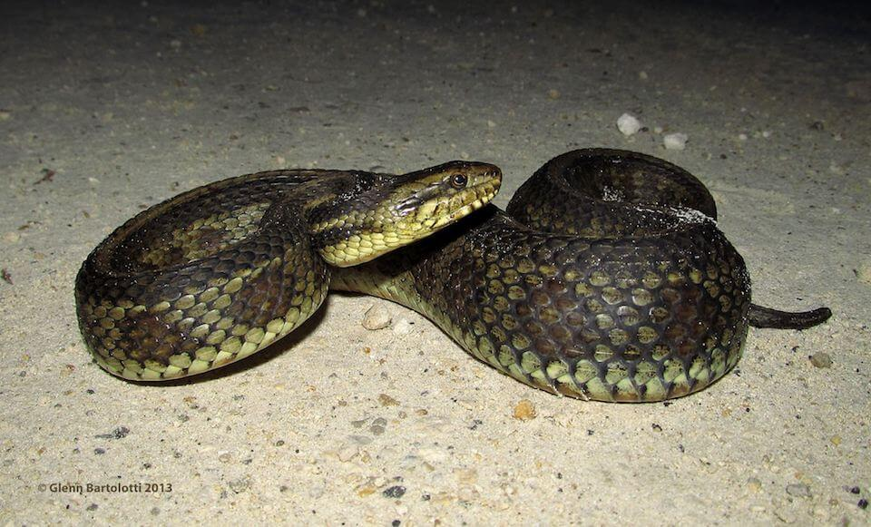

<content-header icon="snakes" title="Gulf salt marsh snake" subtitle="Nerodia clarkii clarkii">
</content-header>

<figcaption>Photo: Glenn Bartolotti</figcaption>

### Overall vulnerability:

High

<h3>Habitat area: 
<a href="/species/reptiles/131/map" style="float:right;font-size:smaller;margin-right: 2rem;">
<fa-icon name="map"></fa-icon>
explore on map
</a>
</h3>

-   63,224 hectares within Florida (modeled)

### Conservation status:

Species of Greatest Conservation Need

## General Information

The Gulf salt marsh snake is one of three subspecies of salt marsh snake in Florida.  This small snake has a flat head and two tan or yellow lengthwise stripes along its body.  It inhabits salt marsh habitats along the Gulf coast.  This nocturnal reptile’s diet consists of small invertebrates, fish and crabs.  The snake hides in sand, mud and debris during the day to avoid its many predators including shorebirds and large crabs.  The Gulf salt marsh snake does not have salt glands so must take care to avoid drinking salt water, instead getting its necessary hydration from precipitation and its prey.

## Habitat Requirements

The Gulf salt marsh snake inhabits brackish and saltwater estuaries, marshes and tidal mud flats along the Gulf coast.

**TODO: habitat crosslinks**

## Climate Impacts

The Gulf salt marsh snake is predicted to be significantly impacted by sea level rise and the associated changes in hydrology that will impact estuarine and salt marsh habitat.  Coastal development is a potential barrier to migration, rendering some populations trapped between rising seas and developed areas.  Shoreline hardening, coastal erosion, and disturbance from extreme weather events also have the potential to negatively impact this species.  Also, this snake faces risks of genetic swamping if it begins to breed with adjacent subspecies during inland migration.

[More information about general climate impacts to species in Florida](/impacts/species).

#### This species is expected to be impacted by sea level rise:

- 3 meters of sea level rise: 100% of area (62,975 ha)
- 1 meter of sea level rise: 98% of area (62,254 ha)

[Explore sea level rise impacts map](/species/reptiles/131/map).

## Vulnerability Assessment(s)

The overall vulnerability level (High) was based on the following assessment(s).
#### 

<h3><a href="/impacts/vulnerability/ccvi">Climate Change Vulnerability Index</a></h3>

Highly vulnerable

 

The primary factors contributing to vulnerability of the Gulf salt marsh snake include sea level rise and the impact of potential changes in hydrology on mangroves and salt marsh.  Over 95% of the species' modeled potential habitat is expected to be impacted by a 1-meter sea level rise.  Coastal armoring is a direct threat to mangrove and salt marsh habitat as well as a blockage to the natural movement of these habitats inland with rising sea level.     Coastal flooding caused by tidal surges associated with hurricanes can displace salt marsh snakes inland, increasing extrinsic mortality.

#### 

<h3><a href="/impacts/vulnerability/sivva/species">Standardized Index of Vulnerability and Value Assessment</a></h3>

Highly vulnerable

 

The primary factors contributing to vulnerability of the Gulf salt marsh snake are sea level rise, erosion,  the presence of barriers, changes in precipitation, and alterations to biotic interactions.

## Adaptation Strategies

- Restoration of existing habitat using dredge soil is a first step to increase habitat and species resilience to the early impacts of climate change.

- Protecting salt marsh migration corridors will allow the snake to move inland as sea level rise occurs.  Areas further from coastal development where the Gulf salt marsh snake has the highest chance of success should be prioritized.

- Given the risk of genetic swamping if the Gulf salt marsh snake begins to overlap with other subspecies, assisted migration to a more isolated area or developing a captive breeding population could be considered to preserve genetic integrity.

[More information about adaptation strategies](/strategies).

## Additional Resources

- [Other Species Profile](https://www.floridamuseum.ufl.edu/herpetology/fl-snakes/list/nerodia-clarkii-clarkii/)
