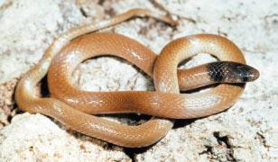

<content-header icon="snakes" title="Rim rock crowned snake" subtitle="Tantilla oolitica"></content-header>

<figcaption>Photo: FWC</figcaption>

### Overall vulnerability:

Moderate

### Conservation status:

State Threatened

## General Information

This rare snake is named for the Miami Rim Rock geological formation found within its small native range that includes the southeastern tip of the Florida peninsula and the Keys.  Rim Rock crowned snakes have dark gray backs and yellow or red bellies with black spots.  The species is nonvenomous and quite small, reaching a length of only about 10 inches.  Little is known about this snake other than its scarcity – only 26 individuals are known to exist in the wild.

## Habitat Requirements

**Total habitat within Florida:** 13,510 hectares (modeled)

Rim Rock crowned snakes inhabit pine rockland and tropical hardwood hammocks within their range.  Proximity to fresh water is critical for this species and they can sometimes be found hiding in rotten logs or other debris piles or in small holes and depressions in the limestone found in their rockland habitat.

**TODO: habitat crosslinks**

**TODO: habitat map (if exists)**

## Climate Impacts

Perhaps not surprisingly given its rarity and range, the Rim Rock crowned snake is extremely vulnerable to climate change.  First, sea level rise is a grave impending threat to the snake’s habitat.  While inundation is a likely eventual scenario, saltwater infiltration of freshwater drinking sources is another, more immediate concern.  Additionally, this species faces many of the same existing threats common to coastal or island species: habitat loss and degradation from coastal development, barriers to migration and habitat disturbance from recreational use.

[More information about general climate impacts to species in Florida](/impacts/species).

#### This species is expected to be impacted by sea level rise:

- 3 meters of sea level rise: 99% of habitat (13,322 ha)
- 1 meter of sea level rise: 80% of habitat (10,827 ha)
    

## Vulnerability Assessment(s)

The overall vulnerability level (Moderate) was based on the following assessment(s).
#### 

<h3><a href="/impacts/vulnerability/sivva/species">Standardized Index of Vulnerability and Value Assessment</a></h3>

Highly vulnerable

 

The primary factors contributing to vulnerability of the rim rock crowned snake are sea level rise, erosion, presence of barriers, habitat fragmentation, and alterations to biotic interactions.

## Adaptation Strategies

- Securing the availability of permanent, freshwater sources is an important adaptation strategy for the Rim rock crowned snake.  Gradual salination of freshwater sources due to sea level rise and immediate infiltration of saltwater into freshwater reserves following a storm event are both concerns for this species.

- Conservation of existing habitat including partnering with other organizations to reach mutual goals in restoration efforts is an important step in recovering and maintaining a healthy population as climate change begins to accelerate.

- As sea level rise may eventually become too great a threat for this species in its current habitat, developing and maintaining a captive breeding population is a strategy to consider for this snake.

[More information about adaptation strategies](/strategies).

## Additional Resources

- [Florida Fish and Wildlife Conservation Commission Species Profile](https://myfwc.com/wildlifehabitats/profiles/reptiles/snakes/rim-rock-crowned-snake/)
