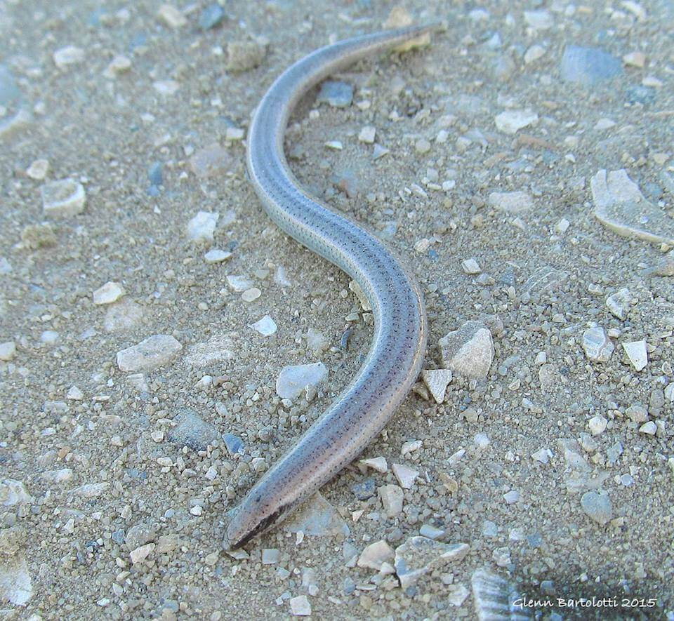

<content-header icon="lizards" title="Sand skink" subtitle="Neoseps reynoldsi"></content-header>

<figcaption>Photo: Glenn Bartolotti</figcaption>

### Overall vulnerability:

This species was not assessed for vulnerability.

<h3>Habitat area: 
<a href="/species/reptiles/148/map" style="float:right;font-size:smaller;margin-right: 2rem;">
<fa-icon name="map"></fa-icon>
explore on map
</a>
</h3>

-   96,668 hectares within Florida (modeled)

### Conservation status:

Federally Threatened

## General Information

This slender, pale gray lizard can reach a length of about 5 inches.  The sand skink’s limbs so reduced they are barely visible at first glance, making the animal appear snake-like.  The sand skink is barely seen above the surface in its central Florida range, however.  Sand skinks are “sand-swimming” creatures – they often can only be identified by the unique wave marks they leave on the surface of the sand while wriggling just below.  Sand skinks eat a diet of insects, including ant lions, spiders and beetle larvae.  They breed in the spring and hatch in the early summer, with juveniles reaching maturity at about two years of age.

## Habitat Requirements

The sand skink is endemic to the sand ridges and ancient coastal dunes of central Florida, including flatwood, scrub, and pine communities.  The sand skink can also be found on working lands – much of its native xeric habitat has been converted to working lands over time.

**TODO: habitat crosslinks**

## Climate Impacts

The sand skink is currently highly threatened by habitat loss and fragmentation, which is likely to intensify even further as the climate changes.  While this lizard’s inland habitat is not likely to be immediately affected by sea level rise, changes in precipitation, temperature and an increase in severe disturbance events are likely to impact the skink’s fitness and reproductive success as well as the quality of its habitat and availability of prey.

[More information about general climate impacts to species in Florida](/impacts/species).

## Vulnerability Assessment(s)

This species was not assessed for vulnerability.

## Adaptation Strategies

- Preserving large, connected patches of suitable habitat is a critical strategy to help the species recover and increase resilience to current threats.  This will become even more important as increased habitat fragmentation pressure linked to climate change sets in.

- Monitoring natural community shifts to prioritize areas for conservation is an important first step in ensuring optimal sand skink habitat can be conserved in a future climate.  Locations of optimal habitat type may shift due to changes in temperature and precipitation and getting ahead of these shifts is necessary to plan for conservation in a future climate.

[More information about adaptation strategies](/strategies).

## Additional Resources

- [Florida Fish and Wildlife Conservation Commission Species Profile](https://myfwc.com/wildlifehabitats/profiles/reptiles/sand-skink/)

- [Multi-Species Recovery Plan for South Florida](https://ecos.fws.gov/docs/recovery_plan/sfl_msrp/SFL_MSRP_Species.pdf)
