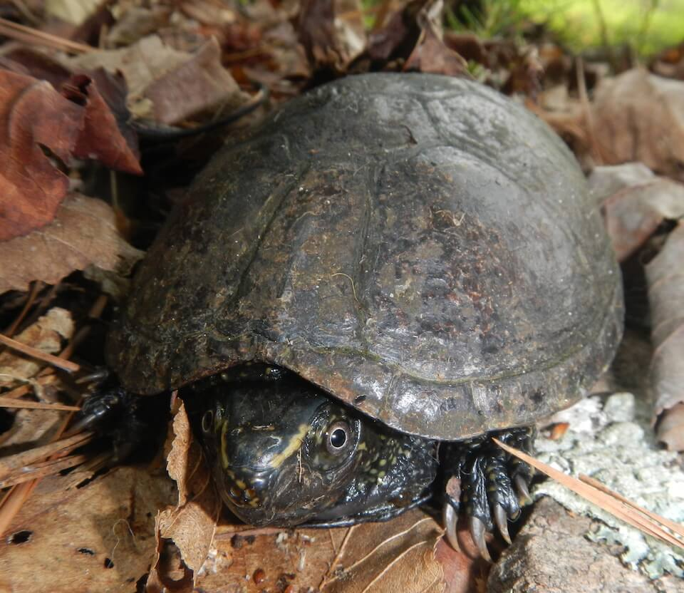

<content-header icon="turtles" title="Striped mud turtle (lower Keys pop)" subtitle="Kinosternon baurii"></content-header>

<figcaption>Photo: NPS</figcaption>

### Overall vulnerability:

High

### Conservation status:

Species of Greatest Conservation Need

## General Information

This small aquatic turtle is found throughout Florida with a protected population specific to the Lower Florida Keys.  The Lower Keys population was protected when it was proposed as a separate taxon but subsequent research has indicated that striped mud turtle populations throughout Florida are not genetically distinct. Striped mud turtles have a brown upper shell with faded stripes that can be difficult to see and a rust-colored lower shell.  These turtles eat a varied diet of insects, snails, seeds and invertebrates and breeds throughout the year with peaks in the fall and early summer

## Habitat Requirements

**Total habitat within Florida:** 2,374 hectares (modeled)

Striped mud turtles inhabit fresh and brackish water ponds and ditches.  This species can tolerate salinity only up to 15 parts per thousand.

**TODO: habitat crosslinks**

**TODO: habitat map (if exists)**

## Climate Impacts

The striped mud turtle is highly threatened by climate change, especially in the Lower Florida Keys where freshwater is an extremely limited resource.  Mud turtle habitat in the Keys and elsewhere in the state is vulnerable to inundation by sea level rise, gradual saltwater encroachment and saltwater contamination following a storm surge event.  This species may also be impacted by rising temperatures associated with climate change.  Like many reptiles, striped mud turtles have temperature-dependent sex determination and embryos become female when incubation temperature rises above 82 degrees Fahrenheit.   Substantially warmer temperatures over time could lead to imbalanced sex ratios in this species.

[More information about general climate impacts to species in Florida](/impacts/species).

#### This species is expected to be impacted by sea level rise:

- 3 meters of sea level rise: 100% of habitat (2,373 ha)
- 1 meter of sea level rise: 100% of habitat (2,368 ha)
    

## Vulnerability Assessment(s)

The overall vulnerability level (High) was based on the following assessment(s).
#### 

<h3><a href="/impacts/vulnerability/sivva/species">Standardized Index of Vulnerability and Value Assessment</a></h3>

Extremely vulnerable

 

The primary factors contributing to vulnerability of the lower Keys population of the striped mud turtle are sea level rise, erosion, presence of barriers, changes in precipitation, changes in salinity, alterations to biotic interactions, and synergies with development.  Alterations in biotic interactions could lead to a decrease in prey availability.

## Adaptation Strategies

- Conservation and restoration of existing freshwater habitat, especially in the Florida Keys, is critical to increase habitat and species health and resilience at the onset of intensifying climate change.

- If nesting becomes degraded or sex ratios are impacted by rising temperatures, artificially created or altered nesting habitat to maintain nesting success and optimal sex ratios is a possible adaptation strategy.  For example, shade structures could be added to nesting sites to improve the likelihood of achieving balanced sex ratios or humanmade freshwater sources could be protected.

[More information about adaptation strategies](/strategies).

## Additional Resources

- [Florida Fish and Wildlife Conservation Commission Species Profile](https://myfwc.com/wildlifehabitats/profiles/reptiles/freshwater-turtles/striped-mud-turtle/)
