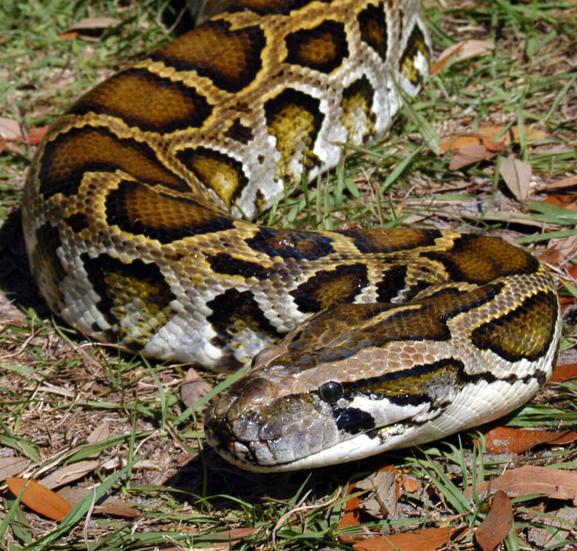

<content-header icon="snakes" title="Burmese python" subtitle="Python  molurus  bivittatus"></content-header>

<figcaption>Photo: FWC</figcaption>

### Overall vulnerability:

Very Low

### Conservation status:

Non-native

## General Information

This large constrictor is invasive in south Florida.  Burmese pythons primarily occur in and around the Everglades ecosystem with the potential for expansion a looming threat.  These snakes have strained the populations of many native mammals since their introduction in the state.  Originally native to Asia and brought to Florida through the pet trade, adult Burmese pythons can reach lengths of 10 to 15 feet, larger than almost any native snake.  Their large size and strength allows these snakes to take a wide variety of prey and outcompete smaller native species.  Burmese pythons are currently limited to the south of Florida primarily by temperature.

## Habitat Requirements

Burmese pythons are highly associated with water and are often found in or near canals, although they are also capable of climbing.  During the warmer months, pythons are often spotted crossing roads during the night.

**TODO: habitat crosslinks**

## Climate Impacts

As an invasive species native to a very warm climate, the Burmese python has the potential to adapt well to a changing climate in Florida and to expand its range northward as temperatures warm.

[More information about general climate impacts to species in Florida](/impacts/species).

## Vulnerability Assessment(s)

The overall vulnerability level (Very Low) was based on the following assessment(s).
#### 

<h3><a href="/impacts/vulnerability/ccvi">Climate Change Vulnerability Index</a></h3>

Not vulnerable   Presumed stable

 

Factors that potentially contribute to "vulnerability" of the Burmese python include sea level rise and the potential impact of changes in hydrology affecting the availability of suitable habitat.  There is potential for the species to expand its range with climate change. Approximately 50-60% of the species' range in Florida is expected to be impacted by a 1-meter sea level rise. Salinity and temperature are natural barriers to this species, but it is uncertain in how much of an effect these barriers could have on potential distributional shifts under climate change.  It is expected that anthropogenic barriers, even urban areas, will not prevent pythons from spreading as long as sufficient prey resources and microhabitats are available.  The current range may be limited by temperature, such that warmer temperatures might promote range expansion.  Predicted future range represents a 20-50% increase relative to current range in Florida.

## Adaptation Strategies

- As an invasive species representing a serious current and future threat to native wildlife, the goal is to reduce and ultimately eradicate Burmese pythons from Florida rather than to help the species adapt to a changing climate.  Python removal efforts should be aggressively pursued with the goal of reducing the python population within the snake’s current range and preventing any future expansion.

[More information about adaptation strategies](/strategies).

## Additional Resources

- [Florida Fish and Wildlife Conservation Commission Species Profile](https://myfwc.com/wildlifehabitats/nonnatives/reptiles/snakes/burmese-python/)
