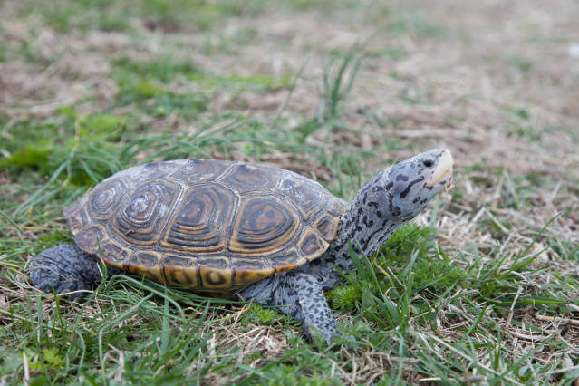

# Diamondback terrapin

### Malaclemys terrapin

<figcaption>Photo: USFWS</figcaption>

### Overall vulnerability:

High

### Conservation status:

Species of Greatest Conservation Need

## General Information

Found in coastal areas from the Florida Keys northward to Cape Cod, the diamondback terrapin has one of the widest ranges of any turtle in North America.  This species gets its name from the striking diamond-shaped pattern on its shell.  Multiple subspecies of diamondback terrapin are documented with four distinct populations occurring in Florida.  The diamondback terrapin is a popular animal, making appearances in sports, popular culture and as a delicacy on many dining menus throughout its history with humans.  Diamondback terrapins are uniquely able to thrive in varying levels of salinity and are strong swimmers with equally strong jaws for crushing shelled prey items.  Females often trek far inland to nest in patches of coastal vegetation.  Females can store sperm from more than one male, at times resulting in clutches with multiple fathers.  Like many turtles, diamondback terrapins have temperature-dependent sex determination.

## Habitat Requirements

Diamondback terrapins have multiple adaptations that allow them to survive in both freshwater and fully saline water, however adult terrapins have a strong preference for brackish coastal habitats.  In Florida, these turtles can be found in mangrove and marsh habitats as well as open beach.

**TODO: habitat crosslinks**

**TODO: habitat map (if exists)**

## Climate Impacts

The diamondback terrapin is likely to be impacted by climate change in different ways across its wide range.  In Florida, sea level rise is a grave impending threat, with over 95% of terrapin habitat projected to be inundated at only 1 meter of sea level rise.  Despite the terrapin’s natural ability to move with a shifting habitat, coastal development and other humanmade barriers are likely to prevent this animal from successful migration within the state.  Although the terrapin is naturally tolerant of varying salinity levels, it is not likely to adapt to a completely inundated habitat.  Like many reptiles, diamondback terrapins have temperature-dependent sex determination and embryos become female when incubation temperature rises above 82 degrees Fahrenheit.   Substantially warmer temperatures over time could lead to imbalanced sex ratios in this species.

[More information about general climate impacts to species in Florida](/impacts/species).

## Vulnerability Assessment(s)

The overall vulnerability level (High) was based on the following assessment(s).
#### 

<h3><a href="/impacts/vulnerability/ccvi">Climate Change Vulnerability Index</a></h3>

Extremely vulnerable

 

The primary factors identified as contributing to vulnerability to climate change for the diamondback terrapin are sea level rise, anthropogenic barriers that may inhibit the species ability to track climatic shifts, and potentially incompatible human responses to climate change.   Greater than 95%  of the species' range is expected to be inundated under a 1-meter sea level rise.  Urban areas pose barriers that would prevent habitat shifts and roads pose a significant threat to individuals.  Shoreline hardening, dredging, beach nourishment, and marsh alteration/draining are factors that are likely or very likely to occur in response to climate change and would have a negative impact on diamondback terrapin.  Altered disturbance regimes (i.e., increased intensity of hurricanes) and changes to hydrology that could affect moisture of the nest substrate and/or salinity of the aquatic habitat were also considered to have the potential to have a strong negative impact on diamondback terrapins.  Additionally, this species is sensitive to changes in temperatures affecting nest substrate through impacts on offspring sex ratios (warmer temperatures tend to bias nests towards females).

#### 

<h3><a href="/impacts/vulnerability/sivva/species">Standardized Index of Vulnerability and Value Assessment</a></h3>

Moderately vulnerable

 

The primary factors contributing to vulnerability of the diamondback terrapin are sea level rise and minimal habitat protection.

## Adaptation Strategies

- Conservation and restoration of existing coastal habitat is critical to increase habitat and species health and resilience at the onset of intensifying climate change.

- If nesting habitat becomes degraded or sex ratios are impacted by rising temperatures, artificially created or altered nesting habitat to maintain nesting success and optimal sex ratios is a possible adaptation strategy.  For example, shade structures could be added to nesting sites to improve the likelihood of achieving balanced sex ratios.

- If barriers to natural migration are too great as sea level rise accelerates, assisted migration may be considered for this species.

[More information about adaptation strategies](/strategies).

## Additional Resources

- [Florida Natural Areas Inventory Profile](http://www.fnai.org/FieldGuide/pdf/Malaclemys_terrapin.PDF)
