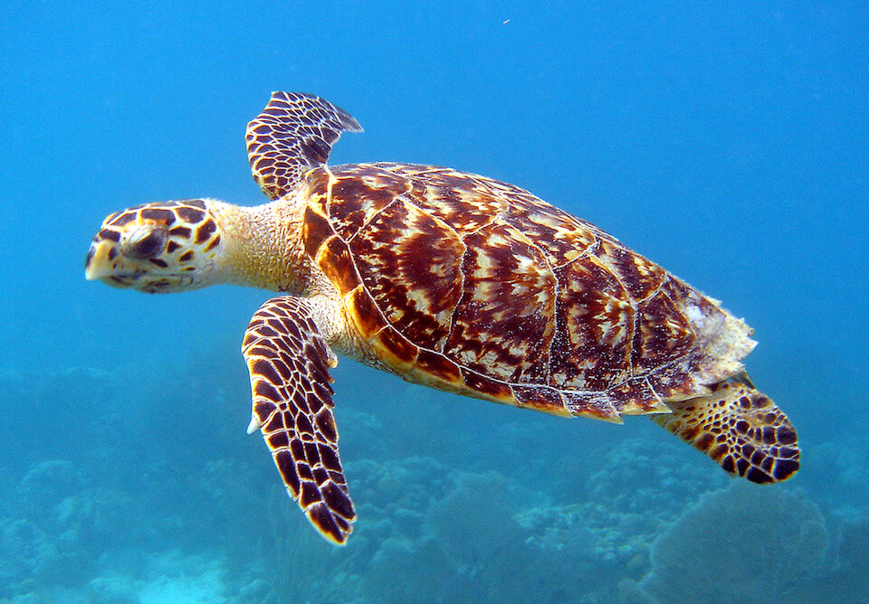

<content-header icon="turtles" title="Hawksbill sea turtle" subtitle="Eretmochelys imbricata">
</content-header>

<figcaption>Photo: USFWS</figcaption>

### Overall vulnerability:

High

### Conservation status:

Federally Endangered

## General Information

Easily recognized by its beak-like nose, the hawksbill is the rarest sea turtle to occur regularly in Florida.  This species occurs throughout subtropical and temperate oceans worldwide and in Florida, hawksbills are found mostly near the southeastern coast of the state and in the Keys.  Hawksbill sea turtles eat a diet almost entirely of sponges and nest in Florida during the summer months.  Females emerge from the sea to build their nests on sandy beaches.  Hawksbill females average three to five clutches per year with an average of 130 eggs per clutch.  Only a small fraction of their many hatchlings survive – after about 50 -90 days of incubation, eggs hatch and young turtles begin their perilous migration to marine waters.

## Habitat Requirements

Hawksbill sea turtles have a wide distribution that includes many subtropical and temperate ocean waters. They require sandy beaches for nesting, often preferring to build nests near or under vegetation.

## Climate Impacts

Hawksbill sea turtles face significant current threats even in the absence of climate change.  The global population of this endangered species has been highly stressed from accidental capture in shrimp and fishing nets.  Turtles that become trapped in these nets are not able to escape and ultimately drown.  Mortality from accidental capture as well as coastal development and exposure to pollutants has left this species in a poor position to respond to the additional threat of climate change.  Increased coastal disturbance from storm events or shoreline hardening associated with climate change is likely to negatively impact hawksbill reproductive success.  Like most turtles, hawksbills have temperature-dependent sex determination, a mechanism that is not likely to adapt quickly to a warming climate, possibly resulting in imbalanced sex ratios and subsequent reproductive decline over time.

[More information about general climate impacts to species in Florida](/impacts/species).

## Vulnerability Assessment(s)

The overall vulnerability level (High) was based on the following assessment(s).
#### 

<h3><a href="/impacts/vulnerability/sivva/species">Standardized Index of Vulnerability and Value Assessment</a></h3>

Extremely vulnerable

 

The primary factors contributing to vulnerability of the hawksbill sea turtle are sea level rise, erosion, presence of barriers, and runoff and storm surge.

## Adaptation Strategies

- Conservation and restoration of existing coastal habitat, including preventing over-development and traffic near nesting areas, is critical to increase habitat and species health and resilience at the onset of intensifying climate change.

- If nesting habitat becomes degraded or sex ratios are impacted by rising temperatures, artificially created or altered nesting habitat to maintain nesting success and optimal sex ratios is a possible adaptation strategy.  For example, shade structures could be added to nesting sites to improve the likelihood of achieving balanced sex ratios.  Programs focused on collecting eggs, incubating them in a controlled setting and releasing hatchlings are a possible strategy for achieving balanced sex ratios and improving reproductive outcomes and hatchling survivorship in increasingly challenging conditions.

[More information about adaptation strategies](/strategies).

## Additional Resources

- [Florida Fish and Wildlife Conservation Commission Species Profile](https://myfwc.com/wildlifehabitats/profiles/reptiles/sea-turtles/hawksbill/)

- [Multi-Species Recovery Plan for South Florida](https://ecos.fws.gov/docs/recovery_plan/sfl_msrp/SFL_MSRP_Species.pdf)
