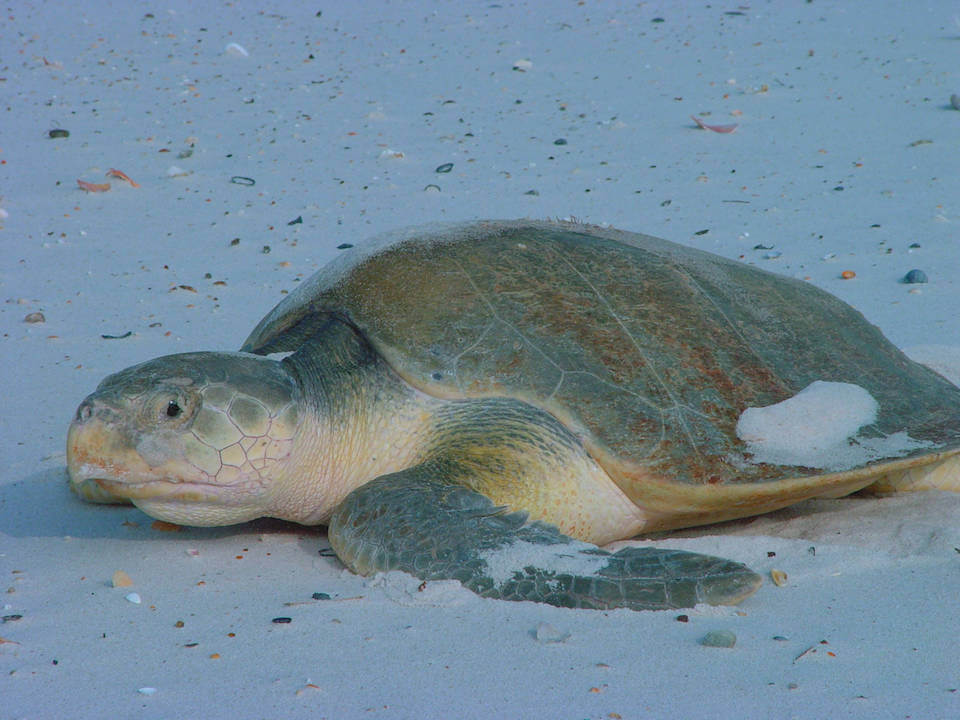

<content-header icon="turtles" title="Kemp’s ridley sea turtle" subtitle="Lepidochelys kempii">
</content-header>

<figcaption>Photo: USFWS</figcaption>

### Overall vulnerability:

High

### Conservation status:

Federally Endangered

## General Information

The Kemp’s ridley sea turtle is the smallest and most endangered sea turtle on the planet. Kemp’s ridley turtles can be recognized by their round, olive colored upper shells and parrot-like beaks.  This species occurs in the waters of the North Atlantic and the Gulf of Mexico.  Females nest primarily near Rancho Nuevo, Mexico but nesting turtles also arrive in Texas and Florida each year.   Kemp’s ridley sea turtles eat a diet primarily of crabs and other small crustaceans.  Females gather offshore and emerge onto sandy beaches where they build their nests together in large groups during the summer months.  Kemp’s ridley females average two or three clutches per year with about 100 eggs per clutch.  Young Kemp’s ridley turtles that survive their dangerous youth reach sexual maturity between 7 and 15 years of age.

## Habitat Requirements

Kemp’s ridley sea turtles have a distribution that includes portions of the North Atlantic and the Gulf of Mexico. They require sandy beaches for nesting habitat.

## Climate Impacts

Kemp’s ridley sea turtles face significant current threats even in the absence of climate change.  The global population of this endangered species has been highly stressed from accidental capture in shrimp and fishing nets.  Turtles that become trapped in these nets are not able to escape and ultimately drown.  Mortality from accidental capture as well as coastal development and exposure to pollutants has left this species in a poor position to respond to the additional threat of climate change.  Increased coastal disturbance from storm events or shoreline hardening associated with climate change is likely to negatively impact Kemp’s ridley reproductive success.  Kemp’s ridley sea turtles have temperature-dependent sex determination, a mechanism that is not likely to adapt quickly to a warming climate, possibly resulting in imbalanced sex ratios and subsequent reproductive decline over time.

[More information about general climate impacts to species in Florida](/impacts/species).

## Vulnerability Assessment(s)

The overall vulnerability level (High) was based on the following assessment(s).
#### 

<h3><a href="/impacts/vulnerability/gcva">Gulf Coast Vulnerability Assessment</a></h3>

Highly vulnerable

 

Kemp's ridley sea turtles nest on barrier island beaches, which are particularly vulnerable to sea level rise.  Nests are also vulnerable to inundation and washout caused by high tides, increased wave actions and heavy rainfall during storm events.  Nest success and sex determination could both be impacted by increased temperatures.  High temperatures can cause complete nest mortality.  Sex determination is temperature-dependent; therefore, increased temperatures can affect hatchling sex rations with higher temperatures only producing females.  High nest site fidelity leads to a low adaptive capacity for this species.  Additionally, low phenotypic plasticity and genetic variation reduces the adaptive capacity for Kemp's ridley to adjust to climate change.

## Adaptation Strategies

- Conservation and restoration of existing coastal habitat, including preventing over-development and traffic near nesting areas, is critical to increase habitat and species health and resilience at the onset of intensifying climate change.

- Avoiding shoreline hardening methods in favor of nature-based solutions for shoreline protection such as living shorelines may benefit this species.

- If nesting habitat becomes degraded or sex ratios are impacted by rising temperatures, artificially created or altered nesting habitat to maintain nesting success and optimal sex ratios is a possible adaptation strategy.  For example, shade structures could be added to nesting sites to improve the likelihood of achieving balanced sex ratios.  Programs focused on collecting eggs, incubating them in a controlled setting and releasing hatchlings are a possible strategy for achieving balanced sex ratios and improving reproductive outcomes and hatchling survivorship in increasingly challenging conditions.

[More information about adaptation strategies](/strategies).

## Additional Resources

- [Florida Fish and Wildlife Conservation Commission Species Profile](https://myfwc.com/wildlifehabitats/profiles/reptiles/sea-turtles/kemps-ridley/)

- [Multi-Species Recovery Plan for South Florida](https://ecos.fws.gov/docs/recovery_plan/sfl_msrp/SFL_MSRP_Species.pdf)
