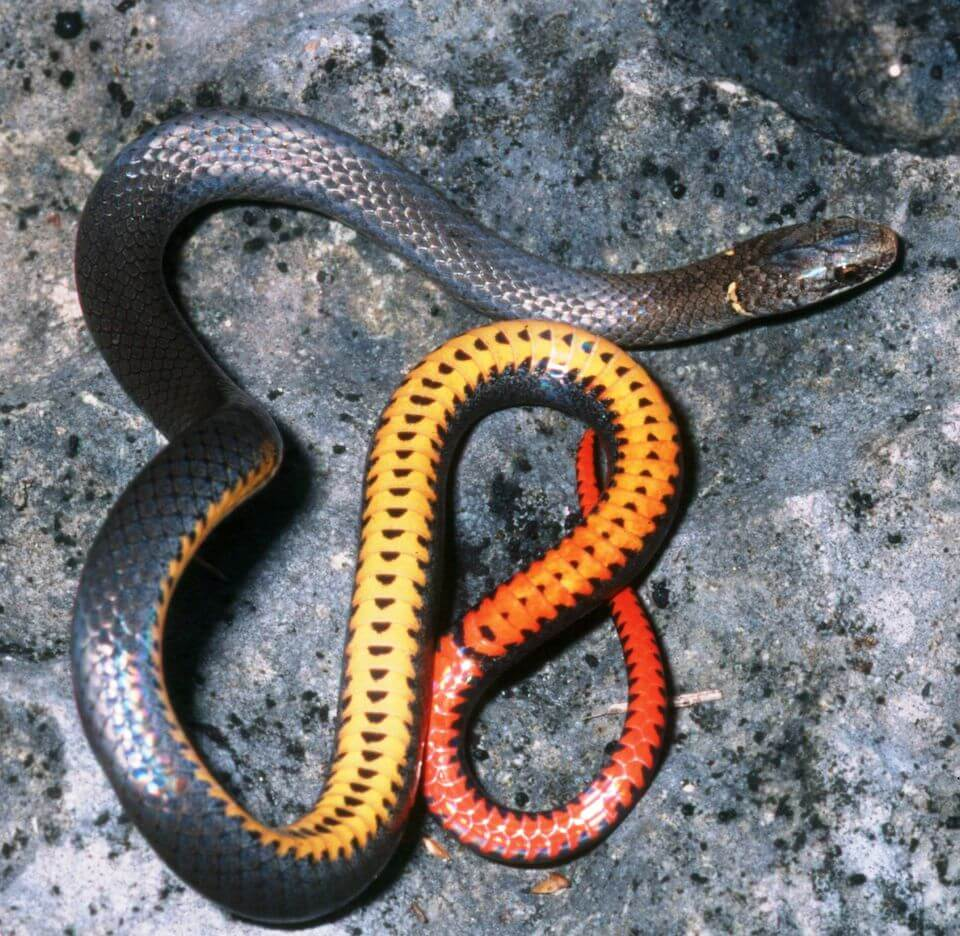

<content-header icon="snakes" title="Key ringneck snake" subtitle="Diadophis punctatus acricus">
</content-header>

<figcaption>Photo: FWC</figcaption>

### Overall vulnerability:

High

### Conservation status:

State Threatened

## General Information

At a body length of 3 to 10 inches, the Key ringneck snake is one of the smallest species in its family.  These snakes are gray with reddish-orange tails, and despite their common name, a neck ring that is either poorly defined or missing.  Key ringneck snakes rely on small prey items their size allows them to capture including amphibians, snakes and insects.  Their distribution is restricted to the Lower Florida Keys.

## Habitat Requirements

Key ringneck snakes inhabit tropical hardwood hammock and scrub habitat types found within their small range on Key West, Big Pine, Little Torch, Middle Torch and No Name Keys.

**TODO: habitat crosslinks**

## Climate Impacts

As an endemic Florida Keys species, the Key ringneck snake faces substantial threats related to climate change.  First, sea level rise is a grave impending threat to the snake’s island habitat.  Storm surge and occasional flooding events, likely to increase in frequency as climate change accelerates, are a danger for this species as well as many snakes would drown in flood waters infiltrating their habitat.  Additionally, this species faces many of the same existing threats common to Florida Keys species: habitat loss and degradation from coastal development, barriers to migration, habitat disturbance from recreational use and high mortality from non-native predators.  Predation by invasive fire ants is an especially significant threat to this species.  These existing threats are likely to be magnified by the shifting conditions of a changing climate.

[More information about general climate impacts to species in Florida](/impacts/species).

## Vulnerability Assessment(s)

The overall vulnerability level (High) was based on the following assessment(s).
#### 

<h3><a href="/impacts/vulnerability/sivva/species">Standardized Index of Vulnerability and Value Assessment</a></h3>

Highly vulnerable

 

The primary factors contributing to vulnerability of the Key ringneck snake are sea level rise, the presence of barriers, habitat fragmentation and changes in salinity.

## Adaptation Strategies

- Controlling existing threats such the spread of invasive fire ants is an important first-step in increasing Key ringneck snake population resilience and ability to adapt.

- Developing refuges within Key ringneck habitat where snakes can seek escape from flood waters is a possible future adaptation strategy for this species.

- Conservation of existing habitat including partnering with other organizations to reach mutual goals in restoration efforts is an important step in maintaining a healthy population as climate change begins to accelerate.

- As sea level rise may eventually become too great a threat for this species in its current habitat, developing and maintaining a captive breeding population is a strategy to consider for this island endemic.

[More information about adaptation strategies](/strategies).

## Additional Resources

- [Florida Fish and Wildlife Conservation Commission Species Profile](https://myfwc.com/wildlifehabitats/profiles/reptiles/snakes/key-ringneck-snake/)
