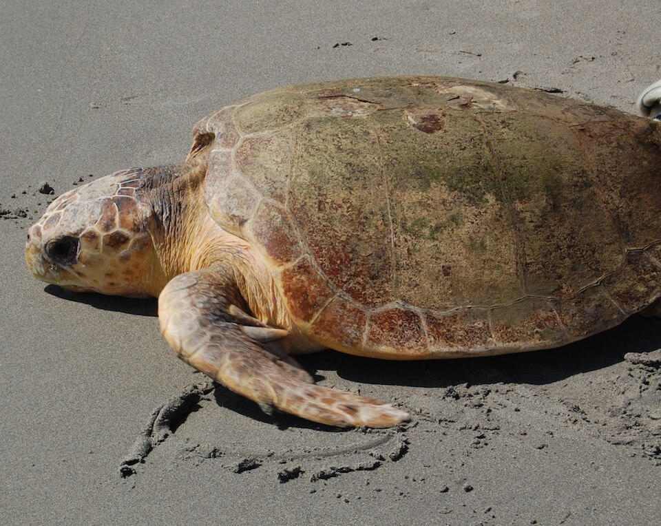

<content-header icon="turtles" title="Loggerhead turtle" subtitle="Caretta caretta">
</content-header>

<figcaption>Photo: FWC</figcaption>

### Overall vulnerability:

Very High

### Conservation status:

Federally Threatened

## General Information

The loggerhead is Florida’s most common species of sea turtle.  Loggerheads are cinnamon brown or cream in color with rough, ruddy shells and large block-like heads for which they are named.  Their large heads support powerful jaws skilled at crushing shelled prey items like clams and crabs.  Florida’s beaches support some of the densest loggerhead nesting habitat in the world.  These turtles return to the same nesting beach every two or so years to lay 4 to 7 consecutive clutches, about one every 14 days.

## Habitat Requirements

Loggerhead sea turtles have a wide global distribution with high nesting concentration along the sandy beaches of both Florida coastlines.

## Climate Impacts

Loggerhead sea turtles face significant current threats even in the absence of climate change.  The global population of this species has been stressed from accidental capture and entanglement in commercial fishing equipment.  Turtles that become trapped or entangled are not able to escape and ultimately drown.  Mortality from accidental capture as well as coastal development and exposure to pollutants has left this species in a poor position to respond to the additional threat of climate change.  Increased coastal disturbance from storm events or shoreline hardening associated with climate change is likely to negatively impact loggerhead reproductive success.  Loggerhead sea turtles have temperature-dependent sex determination, a mechanism that is not likely to adapt quickly to a warming climate, possibly resulting in imbalanced sex ratios and subsequent reproductive decline over time.

[More information about general climate impacts to species in Florida](/impacts/species).

## Vulnerability Assessment(s)

The overall vulnerability level (Very High) was based on the following assessment(s).
#### 

<h3><a href="/impacts/vulnerability/ccvi">Climate Change Vulnerability Index</a></h3>

Extremely vulnerable

 

The major factors contributing to the vulnerability of the loggerhead turtle include sea level rise, anthropogenic barriers impacting the nesting habitat, and potentially incompatible human responses to climate change.  Approximately 90% of the species' nesting habitat is expected to be impacted by a 1-meter sea level rise.  Up to 80% of the nesting habitat is bordered by inland urban areas.  Shoreline hardening is a potential factor that will have a negative impact on the availability of nesting habitat.  Increased intensity and changes in the timing of hurricanes and flooding events are major disturbance regimes likely to affect loggerhead turtle under climate change. A shift towards earlier storms could impact nest success and/or hatchling survival.  Loggerheads are sensitive to changes in temperatures affecting nest substrate through impacts on offspring sex ratios.

#### 

<h3><a href="/impacts/vulnerability/sivva/species">Standardized Index of Vulnerability and Value Assessment</a></h3>

Extremely vulnerable

 

The primary factors contributing to vulnerability of the loggerhead sea turtle are sea level rise, erosion, the presence of barriers, and runoff and storm surge.

## Adaptation Strategies

- Conservation and restoration of existing coastal habitat, including preventing over-development and traffic near nesting areas, is critical to increase habitat and species health and resilience at the onset of intensifying climate change.

- Avoiding shoreline hardening methods in favor of nature-based solutions for shoreline protection such as living shorelines may benefit this species.

- If nesting habitat becomes degraded or sex ratios are impacted by rising temperatures, artificially created or altered nesting habitat to maintain nesting success and optimal sex ratios is a possible adaptation strategy.  For example, shade structures could be added to nesting sites to improve the likelihood of achieving balanced sex ratios.  Programs focused on collecting eggs, incubating them in a controlled setting and releasing hatchlings are a possible strategy for achieving balanced sex ratios and improving reproductive outcomes and hatchling survivorship in increasingly challenging conditions.

[More information about adaptation strategies](/strategies).

## Additional Resources

- [Florida Fish and Wildlife Conservation Commission Species Profile](https://myfwc.com/wildlifehabitats/profiles/reptiles/sea-turtles/loggerhead-turtle/)

- [Multi-Species Recovery Plan for South Florida](https://ecos.fws.gov/docs/recovery_plan/sfl_msrp/SFL_MSRP_Species.pdf)
