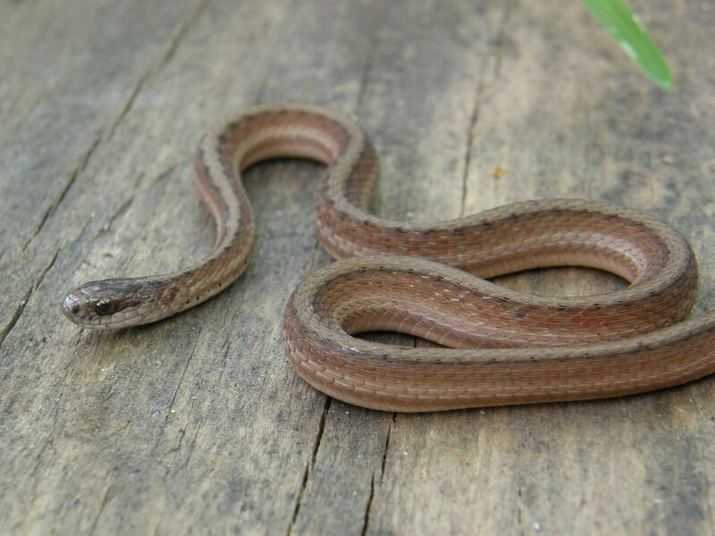

<content-header icon="snakes" title="Marsh brown snake" subtitle="Storeria dekayi limnetes"></content-header>

<figcaption><a href="https://commons.wikimedia.org/w/index.php?curid=21703585" target="_blank" rel="noopener noreferrer">Photo: John Sullivan</a></figcaption>

### Overall vulnerability:

Moderate

### Conservation status:

Species of Greatest Conservation Need

## General Information

The marsh brown snake is a subspecies of the brown snake that occurs in the far western panhandle of Florida and into Alabama and Texas.  These snakes are small, thin and brown with muted fleckings on their sides.  Marsh brown snakes are obscure in Florida and relatively unknown but they are thought to eat a diet of slugs, snails and earthworms.  These snakes are live bearing, breeding during the early spring and summer each year.

## Habitat Requirements

Marsh brown snakes are associated with wetland habitats including wet prairie, marshes and estuaries.

**TODO: habitat crosslinks**

**TODO: habitat map (if exists)**

## Climate Impacts

As a species with a relatively small range, the marsh brown snake is vulnerable to habitat fragmentation and loss.  While not directly linked to climate change at present, additional habitat fragmentation is likely to intensify in many areas as a changing climate begins to drive shifts in land use.  This species is also vulnerable to changes in precipitation patterns and hydrology and well as extreme temperature shifts.

[More information about general climate impacts to species in Florida](/impacts/species).

## Vulnerability Assessment(s)

The overall vulnerability level (Moderate) was based on the following assessment(s).
#### 

<h3><a href="/impacts/vulnerability/sivva/species">Standardized Index of Vulnerability and Value Assessment</a></h3>

Moderately vulnerable

 

The primary factors contributing to vulnerability of the marsh brown snake are sea level rise, erosion, presence of barriers, and habitat fragmentation.

## Adaptation Strategies

- Conservation and restoration of existing wetland habitat is critical to increase habitat and species health and resilience at the onset of intensifying climate change.

[More information about adaptation strategies](/strategies).

## Additional Resources

- [Other Species Profile](https://www.floridamuseum.ufl.edu/herpetology/fl-snakes/list/storeria-dekayi-limnetes/)
