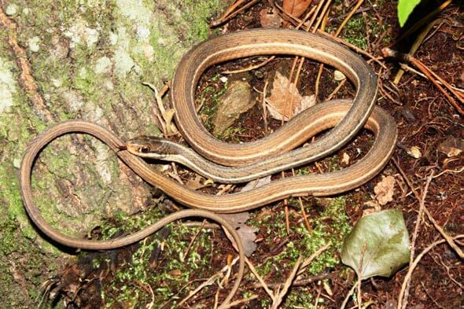

<content-header icon="snakes" title="Peninsular ribbon snake (lower keys pop’l)" subtitle="Thamnophis sauritus sackenii">
</content-header>

<figcaption>Photo: FWC</figcaption>

### Overall vulnerability:

High

### Conservation status:

Species of Greatest Conservation Need

## General Information

Large compared to many Florida Keys species, the Florida peninsula ribbon snake can reach a body length of up to 40 inches.  It is easy to identify as the only striped snake in the Keys.   Ribbon snakes eat varied diet of aquatic and terrestrial prey including fish, frogs and lizards.  These snakes are live-bearing with an annual summer breeding season.  Their distribution is restricted to the Lower Florida Keys.

## Habitat Requirements

The Keys population of the Florida ribbon snake inhabits marsh grass and mangrove habitat within its small range.  These snakes will also make use of freshwater ditches and puddles on occasion.

**TODO: habitat crosslinks**

## Climate Impacts

The Florida Peninsula ribbon snake faces substantial threats related to climate change.  First, sea level rise is a grave impending threat to the snake’s island habitat.  Storm surge and occasional flooding events, likely to increase in frequency as climate change accelerates, threaten to infiltrate this animal’s freshwater habitat with saline.  Additionally, this population faces many of the same existing threats common to Florida Keys species: habitat loss and degradation from coastal development, barriers to migration, habitat disturbance from recreational use and high mortality from non-native predators.  These existing threats are likely to be magnified by the shifting conditions of a changing climate.

[More information about general climate impacts to species in Florida](/impacts/species).

## Vulnerability Assessment(s)

The overall vulnerability level (High) was based on the following assessment(s).
#### 

<h3><a href="/impacts/vulnerability/sivva/species">Standardized Index of Vulnerability and Value Assessment</a></h3>

Highly vulnerable

 

The primary factors contributing to vulnerability of the Lower Keys population of the Peninsular ribbon snake are sea level rise, the presence of barriers, changes in precipitation, habitat fragmentation, changes in salinity, alterations to biotic interactions, and synergies with development.

## Adaptation Strategies

- Developing freshwater sources secure from saltwater infiltration during a storm of flood event is a strategy that could benefit this population.

- Conservation of existing habitat including partnering with other organizations to reach mutual goals in restoration efforts is an important step in maintaining a healthy population as climate change begins to accelerate.

- As sea level rise may eventually become too great a threat for this species in its current habitat, developing and maintaining a captive breeding population is a strategy to consider if maintaining a distinct Florida Keys population of this species is a goal.

[More information about adaptation strategies](/strategies).

## Additional Resources

- [Florida Fish and Wildlife Conservation Commission Species Profile](https://myfwc.com/wildlifehabitats/profiles/reptiles/snakes/peninsula-ribbon-snake/)
