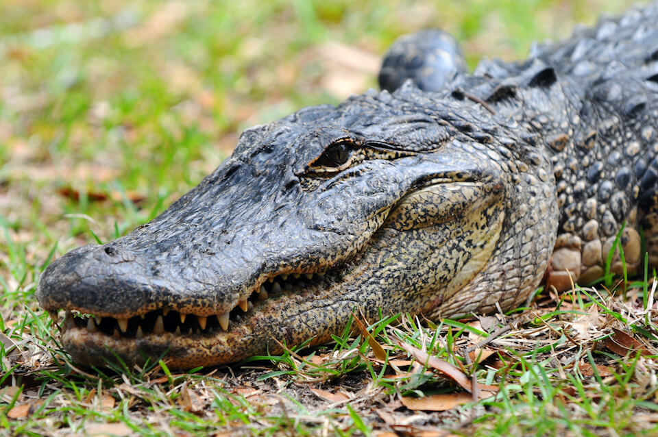

<content-header icon="crocodilians" title="American alligator" subtitle="Alligator mississippiensis"></content-header>

<figcaption>Photo: FWC</figcaption>

### Overall vulnerability:

This species was not assessed for vulnerability.

### Conservation status:

Federally Threatened

## General Information

A popular colloquialism in Florida, is “if you see a body of water, assume it has a gator.”  Alligators are found in multiple southeastern states from Texas to North Carolina but are iconic and common in Florida.  Alligators can be distinguished from crocodiles by their broader snouts and more extensive range throughout the entire state.  Alligators are ectotherms and must control their body temperature by basking in the sun for warmth or moving to cooler areas.  Alligators are top predators and are non-discriminatory in diet, taking any aquatic or terrestrial prey they are capable of capturing based on their body size.

## Habitat Requirements

While alligators will occasionally enter brackish environments, they prefer freshwater habitats and are generalists in specific habitat types.  They can be found in ponds, lakes, rivers, swamps, and marshes throughout their southern range.

**TODO: habitat crosslinks**

## Climate Impacts

Depending on specific location, alligator habitat faces a number of impacts related to climate change including inundation from sea level rise or rising salinity levels.  Inland habitat is at risk from extended periods of drought, sedimentation or changes in water chemistry.   Changes in temperature including direct mortality from cold snaps are also a potential threat.  As alligators have temperature-dependent sex determination, altered sex ratios under changing temperature conditions are a concern.  However, the wide range of this species, its status as a top predator and its generalist tendencies in habitat and diet are all factors that weigh favorably toward the alligator’s ability to adapt to changing conditions.

[More information about general climate impacts to species in Florida](/impacts/species).

## Vulnerability Assessment(s)

This species was not assessed for vulnerability.

## Adaptation Strategies

- If nesting and nursery habitat becomes degraded or sex ratios are impacted by rising temperatures, artificially created or altered nesting or nursery habitat to maintain nesting success and optimal sex ratios is a possible adaptation strategy.  For example, shade structures could be added to nesting sites to improve the likelihood of achieving balanced sex ratios.

[More information about adaptation strategies](/strategies).

## Additional Resources

- [Florida Fish and Wildlife Conservation Commission Species Profile](https://myfwc.com/wildlifehabitats/profiles/reptiles/alligator/)
