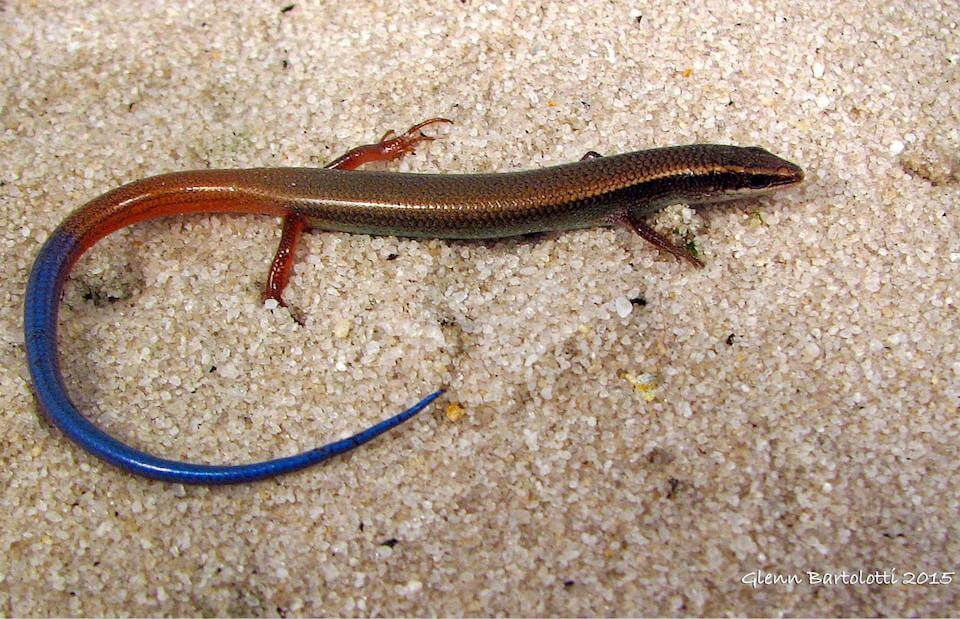

<content-header icon="lizards" title="Bluetail mole skink" subtitle="Eumeces egregius lividus"></content-header>

<figcaption>Photo: Glenn Bartolotti</figcaption>

### Overall vulnerability:

This species was not assessed for vulnerability.

### Conservation status:

Federally Threatened

## General Information

This small brown skink is a subspecies endemic to a small range in central Florida.  The bluetail mole skink relies on a diet of roaches, crickets and spiders.  Little is known about the reproduction and life history of this lizard.

## Habitat Requirements

The bluetail mole skink inhabits xeric hammocks, sandhill and scrub habitats within its small range.  They require loose sandy soil for burrowing.

**TODO: habitat crosslinks**

## Climate Impacts

The bluetail mole skink is likely to be impacted by climate change primarily through alteration and loss of habitat.  Rising temperatures, shifting precipitation patterns and altered fire regimes are likely to alter community structure in skink habitat over time.  Extreme weather events causing flooding also a threat.  Spreading invasive plant species in a changing climate could change community composition, resulting in increasingly fragmented habitat.

[More information about general climate impacts to species in Florida](/impacts/species).

## Vulnerability Assessment(s)

This species was not assessed for vulnerability.

## Adaptation Strategies

- Implementing an appropriate fire regime is an important adaptive management strategy for the bluetail mole skink.  If skink habitat is not regularly burned, hardwood encroachment can cause the quality of habitat to decline.  Climate change is likely to make prescribed fire more challenging as optimal burning conditions become increasingly rare, thus implementing a consistent fire management regime early is crucial.

- As controlled burning becomes more challenging in a changing climate, other habitat management strategies such as mechanical thinning may need to be pursued to maintain optimal habitat.

- Controlling existing threats not directly related to climate change, such as habitat loss and fragmentation, and predation by non-native species such as feral hogs, is an important first-step adaptation strategy for this skink.

[More information about adaptation strategies](/strategies).

## Additional Resources

- [Florida Fish and Wildlife Conservation Commission Species Profile](https://myfwc.com/wildlifehabitats/profiles/reptiles/bluetail-mole-skink/)

- [Multi-Species Recovery Plan for South Florida](https://ecos.fws.gov/docs/recovery_plan/sfl_msrp/SFL_MSRP_Species.pdf)
