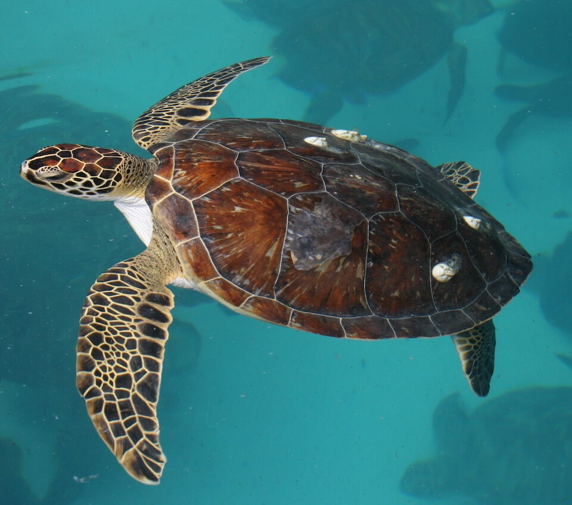

<content-header icon="turtles" title="Green sea turtle" subtitle="Chelonia mydas">
</content-header>

<figcaption>Photo: FWC</figcaption>

### Overall vulnerability:

High

### Conservation status:

Federally Threatened

## General Information

These streamlined green turtles rely on a primarily vegetarian diet of seagrass and algae.  During the day, green sea turtles graze in seagrass meadows, returning to rocky ledges or reefs to rest at night.  Florida hosts one of the largest groupings of green turtle nests in the North Atlantic – approximately 37,000 green sea turtle nests were recorded in the state in 2015.

## Habitat Requirements

Green sea turtles are closely tied to their food source, remaining near choice seagrass beds throughout much of their lifecycle.  Green sea turtles require sandy beaches for nesting like most sea turtles.

## Climate Impacts

Green sea turtles face significant current threats even in the absence of climate change.  The global population of this species has been stressed from accidental capture and entanglement in commercial fishing equipment.  Turtles that become trapped or entangled are not able to escape and ultimately drown.  Mortality from accidental capture as well as coastal development and exposure to pollutants has left this species in a poor position to respond to the additional threat of climate change.  Increased coastal disturbance from storm events or shoreline hardening associated with climate change is likely to negatively impact green turtle reproductive success.  Green sea turtles have temperature-dependent sex determination, a mechanism that is not likely to adapt quickly to a warming climate, possibly resulting in imbalanced sex ratios and subsequent reproductive decline over time.

[More information about general climate impacts to species in Florida](/impacts/species).

## Vulnerability Assessment(s)

The overall vulnerability level (High) was based on the following assessment(s).
#### 

<h3><a href="/impacts/vulnerability/sivva/species">Standardized Index of Vulnerability and Value Assessment</a></h3>

Highly vulnerable

 

The primary factors contributing to vulnerability of the green sea turtle are sea level rise, erosion, presence of barriers, runoff and storm surge, and synergies with development.

## Adaptation Strategies

- Conservation and restoration of existing coastal habitat, including preventing over-development and traffic near nesting areas, is critical to increase habitat and species health and resilience at the onset of intensifying climate change.

- Avoiding shoreline hardening methods in favor of nature-based solutions for shoreline protection such as living shorelines may benefit this species.

- If nesting habitat becomes degraded or sex ratios are impacted by rising temperatures, artificially created or altered nesting habitat to maintain nesting success and optimal sex ratios is a possible adaptation strategy.  For example, shade structures could be added to nesting sites to improve the likelihood of achieving balanced sex ratios.  Programs focused on collecting eggs, incubating them in a controlled setting and releasing hatchlings are a possible strategy for achieving balanced sex ratios and improving reproductive outcomes and hatchling survivorship in increasingly challenging conditions.

[More information about adaptation strategies](/strategies).

## Additional Resources

- [Florida Fish and Wildlife Conservation Commission Species Profile](https://myfwc.com/wildlifehabitats/profiles/reptiles/sea-turtles/green-sea-turtle/)

- [Multi-Species Recovery Plan for South Florida](https://ecos.fws.gov/docs/recovery_plan/sfl_msrp/SFL_MSRP_Species.pdf)
