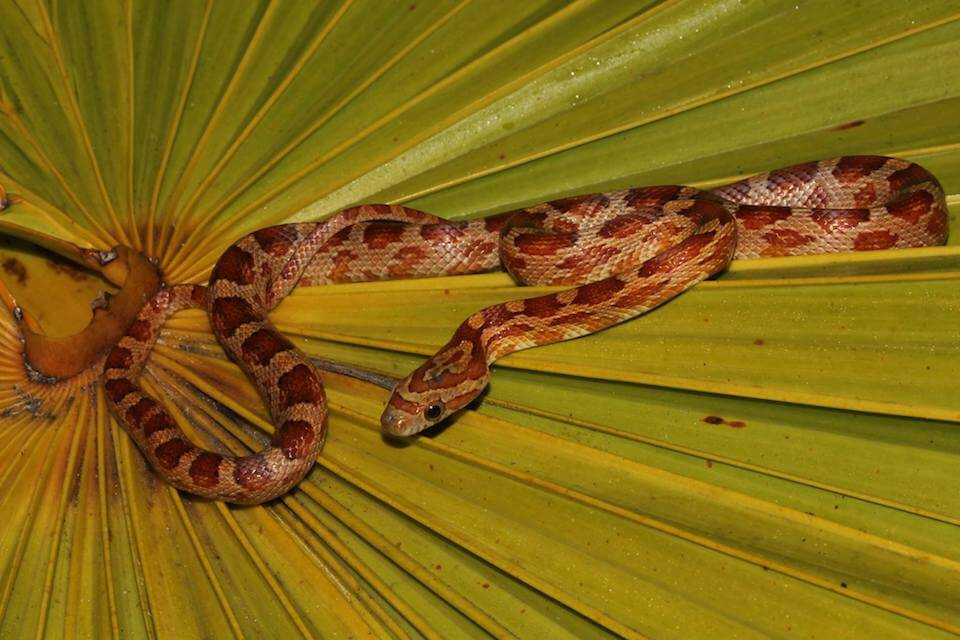

<content-header icon="snakes" title="Red rat snake (lower keys pop’l)" subtitle="Pantherophis guttatus"></content-header>

<figcaption>Photo: FWC</figcaption>

### Overall vulnerability:

Moderate

### Conservation status:

Species of Greatest Conservation Need

## General Information

The red rat snake is a mid-sized constrictor, growing on average between three and four feet in length. This species typically has a tan to orange coloring with large red blotches along its length, and a “V” on its head. As one of the most skilled climbing snake species in Florida, the red rat snake is skilled at capturing bird eggs, lizards, and small mammals.  The Lower Keys population of red rat snakes tend to be slightly smaller in size than the mainland snakes, resulting in smaller clutches of eggs after breeding. Red rat snakes breed between the months of April and June and average about 40 eggs per clutch.

## Habitat Requirements

The red rat snake can be found all throughout Florida, with snakes being documented on almost all the islands of the Florida Keys. This species inhabits rockland hammocks, pine rocklands and even mangrove habitats, using the brush and shrubbery for shelter and cover while hunting. Red rat snakes can also inhabit urban areas and other disturbed habitats.

**TODO: habitat crosslinks**

## Climate Impacts

The Lower Keys red rat snake population faces specific climate-related threats. Inundation from sea level rise and freshwater availability are especially critical threats for the Keys population.  This population of red rat snakes is also strained by the existing threats of habitat destruction, predation by nonnative species and human interaction and harvesting, decreasing population resilience and capacity to respond to additional stressors related to climate change.

[More information about general climate impacts to species in Florida](/impacts/species).

## Vulnerability Assessment(s)

The overall vulnerability level (Moderate) was based on the following assessment(s).
#### 

<h3><a href="/impacts/vulnerability/sivva/species">Standardized Index of Vulnerability and Value Assessment</a></h3>

Highly vulnerable

 

The primary factors contributing to vulnerability of the lower Keys populations of the red rat snake are sea level rise, erosion, presence of barriers, habitat fragmentation, and alterations to biotic interactions.  Biotic interactions includes decline in major prey base for juvenile snakes (frogs) if the salinity of the frog breeding sites increases.

## Adaptation Strategies

- Controlling existing threats such the spread of invasive fire ants is an important first-step in increasing resilience and ability to adapt in the Lower Keys red rat snake population.

- Conservation of existing habitat including partnering with other organizations to reach mutual goals in restoration efforts is an important step in maintaining a healthy population as climate change begins to accelerate.

- As sea level rise may eventually become too great a threat for this population in its current habitat, developing and maintaining a captive breeding population is a strategy to consider for this island endemic, if a goal is to maintain genetic integrity in the Lower Keys population.

[More information about adaptation strategies](/strategies).

## Additional Resources

- [Florida Fish and Wildlife Conservation Commission Species Profile](https://myfwc.com/wildlifehabitats/profiles/reptiles/snakes/red-rat-snake/)
