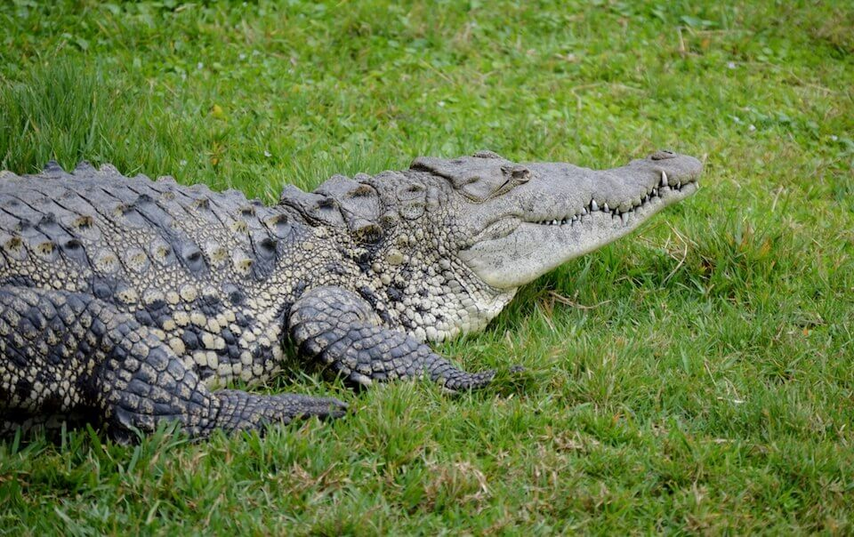

# American crocodile
### *Crocodylus acutus*

<figcaption><a href="https://commons.wikimedia.org/w/index.php?curid=31388948" target="_blank" rel="noopener noreferrer">Photo: Agsftw</a></figcaption>

**Conservation status:** Federally Threatened

**TODO:vulnerability**

This reclusive reptile inhabits coastal areas throughout the Caribbean with a range limited to Puerto Rico and southern Florida within the United States.  Crocodiles are similar in appearance to the more common American alligator but are lighter in color and have longer, more pointed V-shaped snouts.  Like alligators, crocodiles are ectotherms and must control their body temperature by basking in the sun for warmth or moving to cooler areas.  Crocodiles are top predators and are non-discriminatory in diet, taking any aquatic or terrestrial prey they are capable of capturing based on their body size.

    
## Habitat Requirements

American crocodiles prefer coastal saltwater or brackish areas including the ponds or creeks of mangrove swamps but can also be found in inland freshwater bodies accessed through canals.

## Climate Impacts

American crocodile habitat is expected to become significantly inundated from even the most conservative estimates (one meter) of sea level rise.  Under various sea level rise scenarios, 30 – 98% of current crocodile habitat will be inundated.  Although new habitat may also become available as the sea levels rise, developed areas may create barriers to northward migration of mangroves and crocodile habitat.  Sea level rise will also drive changes in water chemistry and salinity that may negatively impact current crocodile habitat even before inundation occurs.  Changes in temperature including direct mortality from cold snaps are also a potential threat.  As crocodiles have temperature-dependent sex determination, altered sex ratios under changing temperature conditions are a major concern.

## Adaptation Strategies

- Monitoring crocodile populations and nesting success is an important first step in identifying early impacts from climate-driven stressors and determining when further intervention is necessary.

- If nesting and nursery habitat becomes degraded or sex ratios are impacted by rising temperatures, artificially created or altered nesting or nursery habitat to maintain nesting success and optimal sex ratios is a possible adaptation strategy.  For example, shade structures could be added to nesting sites to improve the likelihood of achieving balanced sex ratios.

- Additional research aimed at better understanding and modeling expected changes to vegetation and mangrove habitat will improve conservationists’ ability to prioritize key areas on which to focus efforts as climate change accelerates.

[More information about adaptation strategies](/strategies).

## Additional Resources

- [Florida Fish and Wildlife Conservation Commission Species Profile](https://myfwc.com/wildlifehabitats/profiles/reptiles/alligator/)

- [Multi-Species Recovery Plan for South Florida](https://ecos.fws.gov/docs/recovery_plan/sfl_msrp/SFL_MSRP_Species.pdf)
