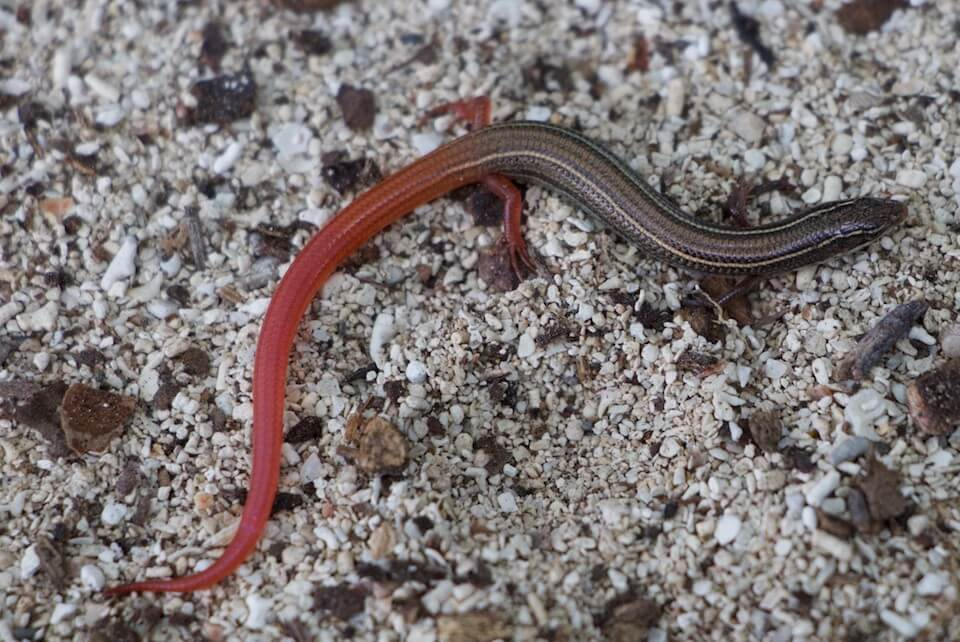

# Florida Keys mole skink

### Plestiodon egregius egregius

<figcaption>Photo: FWC</figcaption>

### Overall vulnerability:

Moderate

### Conservation status:

State Threatened

## General Information

This small brown skink is native to the Florida Keys as its name implies.  The Florida Keys mole skink is a secretive creature and little is known about its life history or reproduction.  These lizards rely on a diet of small insects and arthropods found within their coastal habitat.  Nesting season occurs in the spring when females lay clutches of 3-5 eggs in underground nests.

## Habitat Requirements

**Total habitat within Florida:** 8,019 hectares (modeled)

The Florida Keys mole skink inhabits sandy shoreline areas throughout on the islands it has colonized, preferring to seek shelter under rocks, sand and tidal debris.

**TODO: habitat crosslinks**

**TODO: habitat map (if exists)**

## Climate Impacts

The Florida Keys mole skink is highly vulnerable to sea level rise.  The lizard’s narrow distribution will make it a challenge for the Florida Keys mole skink to adapt to increasingly harsh island conditions.  Sea level rise, coastal erosion and increasingly strong or frequent storm events are likely to be a concern for this species.

[More information about general climate impacts to species in Florida](/impacts/species).

#### This species is expected to be impacted by sea level rise:

- 3 meters of sea level rise: 100% of habitat (8,014 ha)
- 1 meter of sea level rise: 95% of habitat (7,585 ha)
    

## Vulnerability Assessment(s)

The overall vulnerability level (Moderate) was based on the following assessment(s).
#### 

<h3><a href="/impacts/vulnerability/sivva/species">Standardized Index of Vulnerability and Value Assessment</a></h3>

Moderately vulnerable

 

The primary factors contributing to vulnerability of the Florida Keys mole skink are sea level rise, erosion, presence of barriers, and habitat fragmentation.

## Adaptation Strategies

- Develop climate smart practices for beach and coastal management including the use of living shorelines as opposed to hard-armoring for coastal protection wherever possible.

- Protect coastal land through fee-simple or easement acquisition of areas serving as natural storm buffers.

- Like many species endemic to the Florida Keys, this species is extremely vulnerable to long-term sea level rise. As such, development of a captive breeding program may be a necessary long-term adaptation strategy.

[More information about adaptation strategies](/strategies).

## Additional Resources

- [Florida Fish and Wildlife Conservation Commission Species Profile](https://myfwc.com/wildlifehabitats/profiles/reptiles/florida-keys-mole-skink/)

- [Multi-Species Recovery Plan for South Florida](https://ecos.fws.gov/docs/recovery_plan/sfl_msrp/SFL_MSRP_Species.pdf)
