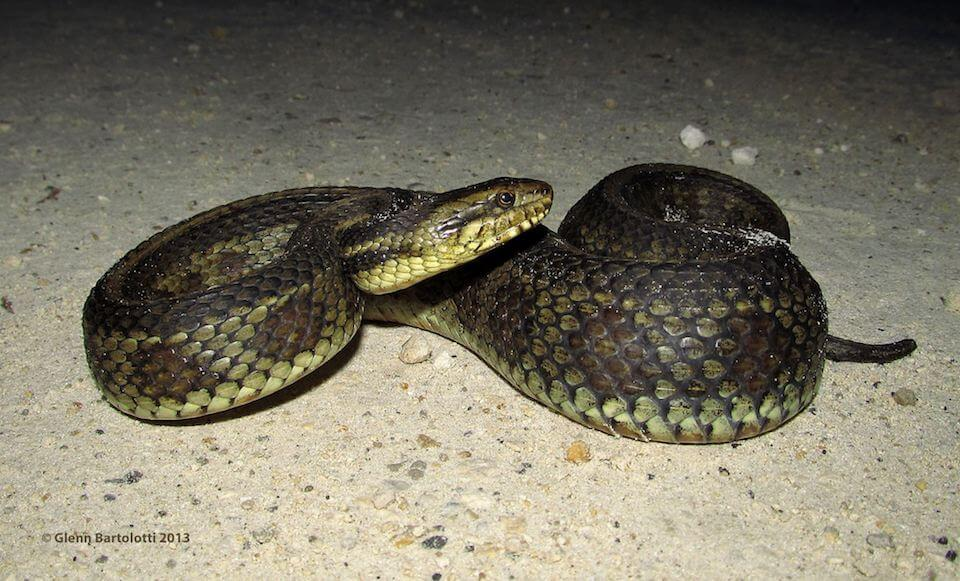

# Atlantic salt marsh snake

### Nerodia clarkii taeniata

<figcaption><a href="https://commons.wikimedia.org/w/index.php?curid=43270589" target="_blank" rel="noopener noreferrer">Photo: USFWS/By Glenn Bartolotti</a></figcaption>

### Overall vulnerability:

Very High

### Conservation status:

Federally Threatened

## General Information

The Atlantic salt marsh snake is one of three subspecies of salt marsh snake in Florida.  This slender, striped snake occurs in the brackish, tidal marshes and mangrove swamps of south Florida.  Making it unique among reptiles living in a salt water habitat, the Atlantic salt marsh snake has not developed salt glands.  Still, this subspecies resists dehydration in saltwater compared to its adjacent freshwater congeners.  Primarily active at night, the Atlantic salt marsh snake feeds primarily on small fish.  Little is known about the life history of this snake, but females are live-bearing and give birth to multiple offspring in the late summer or fall.

## Habitat Requirements

**Total habitat within Florida:** 8,034 hectares (modeled)

The Atlantic salt marsh snake inhabits coastal salt marshes and mangrove swamps.  It is often associated with fiddler crab burrows and can be found in tidal pools.  It has a salinity tolerance that ranges from brackish to saline.

**TODO: habitat crosslinks**

**TODO: habitat map (if exists)**

## Climate Impacts

The Atlantic salt marsh snake is predicted to be significantly impacted by sea level rise and the associated changes in hydrology that will impact mangrove and salt marsh habitat.  Coastal development in south Florida is likely to be a barrier to migration, rendering some populations trapped between rising seas and developed areas.  Populations at the north end of the range or more removed from a developed coastline have the highest adaptation potential.  Also, this snake faces risks of genetic swamping if it begins to breed with adjacent freshwater subspecies during inland migration.

[More information about general climate impacts to species in Florida](/impacts/species).

#### This species is expected to be impacted by sea level rise:

- 3 meters of sea level rise: 100% of habitat (8,025 ha)
- 1 meter of sea level rise: 98% of habitat (7,890 ha)
    

## Vulnerability Assessment(s)

The overall vulnerability level (Very High) was based on the following assessment(s).
#### 

<h3><a href="/impacts/vulnerability/ccvi">Climate Change Vulnerability Index</a></h3>

Extremely vulnerable

 

The primary factors contributing to vulnerability of the Atlantic salt marsh snake include sea level rise and the impact of potential changes in hydrology on mangroves and salt marsh.  Over 95% of the species' modeled potential habitat is expected to be impacted by a 1-meter sea level rise.   Coastal armoring is a direct threat to mangrove and salt marsh habitat as well as a blockage to the natural movement of these habitats inland with rising sea level.  Water control impoundments, which alter local tidal hydrologic cycles, are identified as an additional threat. Coastal flooding caused by tidal surges associated with hurricanes can displace salt marsh snakes inland, increasing extrinsic mortality.

#### 

<h3><a href="/impacts/vulnerability/sivva/species">Standardized Index of Vulnerability and Value Assessment</a></h3>

Highly to Extremely vulnerable

 

The primary factors contributing to vulnerability of the Atlantic salt marsh snake are sea level rise, erosion, the presence of barriers, changes in precipitation, minimal habitat protection, and alterations to biotic interactions.

## Adaptation Strategies

- Restoration of existing habitat using dredge soil is a first step to increase habitat and species resilience to the early impacts of climate change.

- Protecting salt marsh migration corridors will allow the snake to move inland as sea level rise occurs.  Areas further from coastal development where the Atlantic salt marsh snake has the highest chance of success should be prioritized.

- Given the risk of genetic swamping if the Atlantic salt marsh snake begins to overlap with other subspecies, assisted migration to a more isolated area or developing a captive breeding population could be considered to preserve genetic integrity.

[More information about adaptation strategies](/strategies).

## Additional Resources

- [Florida Fish and Wildlife Conservation Commission Species Profile](https://myfwc.com/wildlifehabitats/profiles/reptiles/snakes/atlantic-salt-marsh-snake/)

- [Multi-Species Recovery Plan for South Florida](https://ecos.fws.gov/docs/recovery_plan/sfl_msrp/SFL_MSRP_Species.pdf)
