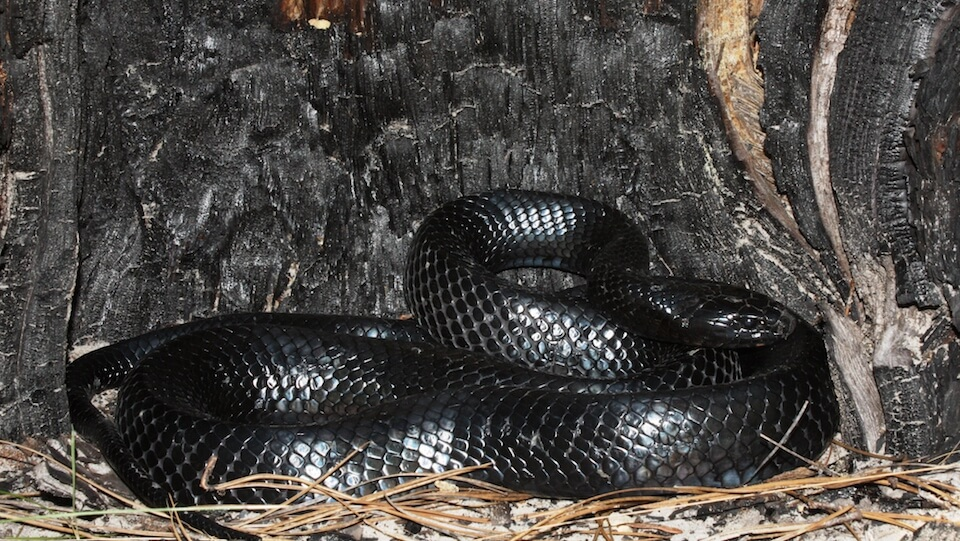

# Eastern indigo snake

### Drymarchon corais couperi

<figcaption>Photo: FWC - Kevin Enge</figcaption>

### Conservation status:

Federally Threatened

### Overall vulnerability:

Low

This large, smooth ink colored snake is non-venomous and docile when confronted.  Eastern indigo snakes are native to the southeastern United States with a range that includes South Carolina, Alabama and most of Florida.  The eastern indigo snake relies on a broad diet of small animals including reptiles, amphibians, birds and mammals.  The Eastern indigo snake is known to commonly eat other snakes, including rattlesnakes as it is immune to their venom.  The eastern indigo is one of many species to benefit from gopher tortoise burrows – females often lay their eggs in these burrows during their summer nesting season.  Unfortunately however, their proclivity for gopher tortoise burrows often brings harm to eastern indigos when they are killed by hunters in pursuit of another common burrow inhabitant, the rattlesnake.

## Habitat Requirements

**Total habitat within Florida:** 5,846,990 hectares (modeled)

The eastern indigo snake is especially associated with the well-drained soils of sandhill habitats in Florida.  However, indigos can also be found in a range of other habitat types including flatwoods, hammocks, upland pine and scrub and even working lands.  The cover requirements of the eastern indigo vary throughout the year and the breeding season so this species relies on the ability to travel between habitat types.

**TODO: habitat crosslinks**

**TODO: habitat map (if exists)**

## Climate Impacts

As a species primarily linked to upland and inland habitat types, the eastern indigo snake is not as vulnerable to sea level rise as many Florida species.  However, habitat fragmentation intensified by climate change is a significant threat for this species because of the snake’s need for a continuous corridor spanning multiple habitat types.  The eastern indigo is also vulnerable to extreme storm and precipitation events that would cause gopher tortoise burrows to flood.  Many of the habitats frequented by eastern indigo snakes are fire maintained systems and the lack of ability to manage with fire as well as the risk of wildfire are threats to the eastern indigo snake as a result.

[More information about general climate impacts to species in Florida](/impacts/species).

#### This species is expected to be impacted by sea level rise:

- 3 meters of sea level rise: 11% of habitat (642,335 ha)
- 1 meter of sea level rise: 5% of habitat (281,304 ha)

[More information about sea level rise impacts on species in Florida](/impacts/species/slr).
    

## Vulnerability Assessment(s)

The overall vulnerability level (Low) was based on the following assessment(s).
#### 

<h3><a href="/impacts/vulnerability/sivva/species">Standardized Index of Vulnerability and Value Assessment</a></h3>
<b class="moderate">Slightly to Moderately vulnerable</b>

 

The primary factors contributing to vulnerability of the Eastern indigo snake are habitat fragmentation, alterations to biotic interactions, and synergies with development.

## Adaptation Strategies

- Implementing an appropriate fire regime or alternative vegetation management strategies if prescribed fire becomes too difficult in a changing climate, is an important adaptation strategy for the eastern indigo snake, as well as the gopher tortoise on which it relies.

- Preserving corridors of connected habitat is critical for the eastern indigo so that it can move freely during various stages of its life cycle and adapt to any changes to its habitat stemming from climate change.

[More information about adaptation strategies](/strategies).

## Additional Resources

- [Florida Fish and Wildlife Conservation Commission Species Profile](https://myfwc.com/wildlifehabitats/profiles/reptiles/snakes/eastern-indigo-snake/)

- [Multi-Species Recovery Plan for South Florida](https://ecos.fws.gov/docs/recovery_plan/sfl_msrp/SFL_MSRP_Species.pdf)
