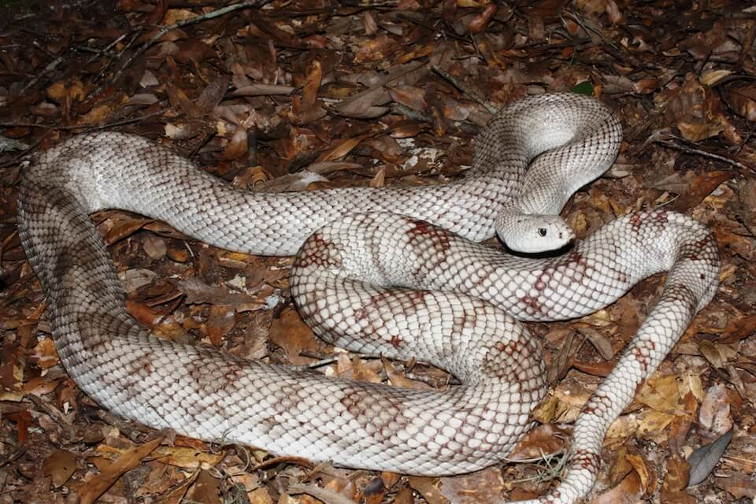

# Florida pine snake

### Pituophis melanoleucus mugitus

<figcaption>Photo: FWC - Kevin Enge</figcaption>

### Conservation status:

State Threatened

### Overall vulnerability:

Not Assessed

The Florida pine snake is one of the largest eastern snakes in North America, capable of reaching an impressive length of 213 centimeters (84 inches).  These brown, spotted snakes are distributed throughout much of Florida and eat a varied diet consisting of small mammals including rabbits, moles, mice and squirrels.  Females construct burrows in sunny spots off which they create smaller side burrows for their nests.

## Habitat Requirements

**Total habitat within Florida:** 5,910,360 hectares (modeled)

Moderate to open canopy with well-drained, sandy soils is the hallmark of Florida pine snake habitat. High pine, scrub and sandhill habitats in Florida are frequently home to Florida pine snakes.

**TODO: habitat crosslinks**

**TODO: habitat map (if exists)**

## Climate Impacts

The Florida pine snake is likely to be impacted by climate change primarily through alteration and loss of habitat.  Rising temperatures, shifting precipitation patterns and altered fire regimes are likely to alter community structure in Florida pine snake habitat over time.  Extreme weather events causing burrows to flood is also a threat.  Spreading invasive plant species in a changing climate could change community composition, resulting in increasingly fragmented habitat.  Sea level rise is likely to impact Florida pine snake habitat closer to the coast.

[More information about general climate impacts to species in Florida](/impacts/species).

#### This species is expected to be impacted by sea level rise:

- 3 meters of sea level rise: 7% of habitat (407,286 ha)
- 1 meter of sea level rise: 3% of habitat (163,253 ha)

[More information about sea level rise impacts on species in Florida](/impacts/species/slr).
    

## Vulnerability Assessment(s)

This species was not assessed for vulnerability.

## Adaptation Strategies

- Implementing an appropriate fire regime is an important adaptive management strategy for the Florida pine snake.  If pine snake habitat is not regularly burned, hardwood encroachment can cause the quality of snake habitat to decline.  Climate change is likely to make prescribed fire more challenging as optimal burning conditions become increasingly rare, thus implementing a consistent fire management regime early is crucial.

- As controlled burning becomes more challenging in a changing climate, other habitat management strategies such as mechanical thinning may need to be pursued to maintain optimal habitat.

- Controlling existing threats not directly related to climate change, such as habitat loss and fragmentation, and predation by non-native species such as feral hogs, is an important first-step adaptation strategy for the Florida pine snake.

[More information about adaptation strategies](/strategies).

## Additional Resources

- [Florida Fish and Wildlife Conservation Commission Species Profile](https://myfwc.com/wildlifehabitats/profiles/reptiles/snakes/florida-pine-snake/)
