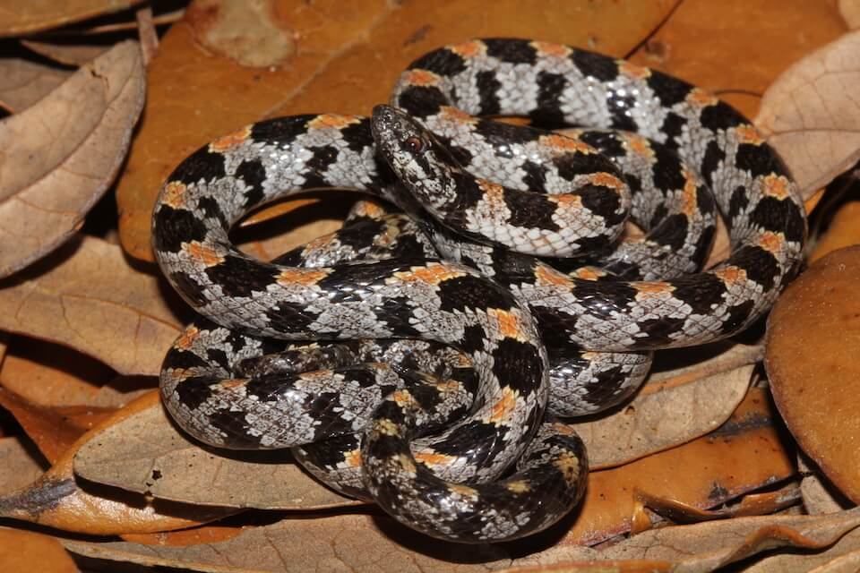

# Short-tailed snake

### Lampropeltis extenuata

<figcaption>Photo: FWC</figcaption>

### Conservation status:

State Threatened

### Overall vulnerability:

Not Assessed

Small, smooth and slender, the short-tailed snake is well adapted to living underground.  Short-tailed snakes are gray with dark brown spots and a small head.  As its name implies, this snake is indeed short-tailed – its tail makes up less than 10% of its total body length.  Rarely seen outside of their underground home, short-tailed snakes primarily eat a diet of other small snakes.  Endemic to Florida, this species can only be found within the central peninsula of the state.

## Habitat Requirements

**Total habitat within Florida:** 323,998 hectares (modeled)

Short-tailed snakes prefer to burrow in well-drained, sandy soils. High pine, scrub and sandhill habitats in Florida are frequently home to this species.

**TODO: habitat crosslinks**

**TODO: habitat map (if exists)**

## Climate Impacts

The Florida pine snake is likely to be impacted by climate change primarily through alteration and loss of habitat.  Rising temperatures, shifting precipitation patterns and altered fire regimes are likely to alter community structure in Florida pine snake habitat over time.  Extreme weather events causing burrows to flood is also a threat.  Spreading invasive plant species in a changing climate could change community composition, resulting in increasingly fragmented habitat.  Sea level rise is likely to impact short-tailed snake habitat closer to the coast.  Additionally, predation from invasive red fire ants is an existing threat for this species.  The spread or increase of nonnative species in a warming climate could significantly impact the short-tailed snake.

[More information about general climate impacts to species in Florida](/impacts/species).

#### This species is expected to be impacted by sea level rise:

- 3 meters of sea level rise: 3% of habitat (10,632 ha)
- 1 meter of sea level rise: <1% of habitat (2,568 ha)

[More information about sea level rise impacts on species in Florida](/impacts/species/slr).
    

## Vulnerability Assessment(s)

This species was not assessed for vulnerability.

## Adaptation Strategies

- Implementing an appropriate fire regime is an important adaptive management strategy for this species.  If short-tailed snake habitat is not regularly burned, hardwood encroachment can cause the quality of snake habitat to decline.  Climate change is likely to make prescribed fire more challenging as optimal burning conditions become increasingly rare, thus implementing a consistent fire management regime early is crucial.

- As controlled burning becomes more challenging in a changing climate, other habitat management strategies such as mechanical thinning may need to be pursued to maintain optimal habitat.

- Controlling existing threats not directly related to climate change, such as habitat loss and fragmentation, and predation by nonnative species is an important first-step adaptation strategy for the short-tailed snake.

[More information about adaptation strategies](/strategies).

## Additional Resources

- [Florida Fish and Wildlife Conservation Commission Species Profile](https://myfwc.com/wildlifehabitats/profiles/reptiles/snakes/short-tailed-snake/)
