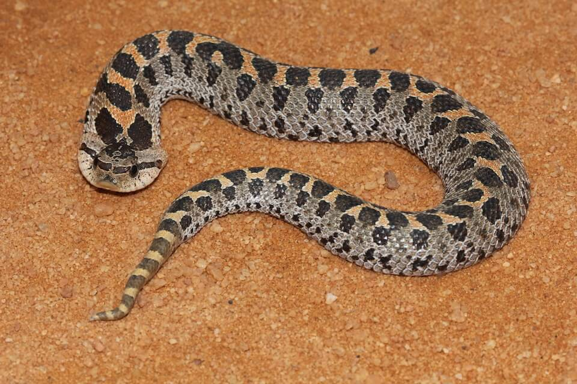

# Southern hognose snake

### Heterodon simus

<figcaption>Photo: FWC</figcaption>

### Conservation status:

Species of Greatest Conservation Need

### Overall vulnerability:

Not Assessed

Short and stout, with a peculiar upturned snout for which it is named, the southern hognose snake is one a few rare, upland snakes found in Florida.  The southern hognose snake is difficult to tell apart from the more common eastern hognose.  Both species of hognose snakes exhibit an unusual behavior when disturbed – these snakes will hiss, spread their necks, gape, roll-over and play dead.

## Habitat Requirements

**Total habitat within Florida:** 2,625,493 hectares (modeled)

Southern hognose snakes inhabit high pine, scrub and sandhill habitats in Florida.

**TODO: habitat crosslinks**

**TODO: habitat map (if exists)**

## Climate Impacts

The southern hognose snake is likely to be impacted by climate change primarily through alteration and loss of habitat.  Rising temperatures, shifting precipitation patterns and altered fire regimes are likely to alter community structure in hognose habitat over time.  Extreme weather events causing flooding or dramatic shifts in temperature can increase mortality in exothermic species.  Spreading invasive plant species in a changing climate could change community composition, resulting in increasingly fragmented habitat.  Sea level rise is likely to impact southern hognose snake habitat closer to the coast.  Additionally, predation from invasive red fire ants is an existing threat for this species.  The spread or increase of nonnative species in a warming climate could significantly impact the southern hognose snake.

[More information about general climate impacts to species in Florida](/impacts/species).

#### This species is expected to be impacted by sea level rise:

- 3 meters of sea level rise: 2% of habitat (42,416 ha)
- 1 meter of sea level rise: <1% of habitat (12,823 ha)

[More information about sea level rise impacts on species in Florida](/impacts/species/slr).
    

## Vulnerability Assessment(s)

This species was not assessed for vulnerability.

## Adaptation Strategies

- Implementing an appropriate fire regime is an important adaptive management strategy for this species.  If southern hognose snake habitat is not regularly burned, hardwood encroachment can cause the quality of snake habitat to decline.  Climate change is likely to make prescribed fire more challenging as optimal burning conditions become increasingly rare, thus implementing a consistent fire management regime early is crucial.

- As controlled burning becomes more challenging in a changing climate, other habitat management strategies such as mechanical thinning may need to be pursued to maintain optimal habitat.

- Controlling existing threats not directly related to climate change, such as habitat loss and fragmentation, and predation by nonnative species is an important first-step adaptation strategy for the southern hognose.

[More information about adaptation strategies](/strategies).

## Additional Resources

- [Florida Natural Areas Inventory Profile](http://www.fnai.org/FieldGuide/pdf/Heterodon_simus.pdf)
