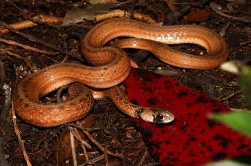

# Florida brown snake  (lower keys pop’l)

### Storeria victa

<figcaption>Photo: FWC</figcaption>

### Overall vulnerability:

This species was not assessed for vulnerability.

### Conservation status:

State Threatened

## General Information

At a maximum length of about 12 inches, Florida brown snakes are one of the smallest species in their family.  These snakes have a reddish-brown back and a cream-colored belly.  The Lower Keys population of the Florida brown snake is limited to Middle Torch, Little Torch, Sugarloaf, Big Pine and No Name Keys.  These live bearing snakes breed during the summer and hibernate during especially cold periods of the winter.  Florida brown snakes eat a diet of slugs, snails, small amphibians and earthworms.

## Habitat Requirements

Florida brown snakes inhabit tropical hardwood hammock and pine rockland habitat types found within their small range.

**TODO: habitat crosslinks**

**TODO: habitat map (if exists)**

## Climate Impacts

As an endemic Florida Keys species, the Lower Keys Florida brown snake population faces substantial threats related to climate change.  First, sea level rise is a grave impending threat to the snake’s island habitat.  Storm surge and occasional flooding events, likely to increase in frequency as climate change accelerates, are a danger for this species as well as many snakes would drown in flood waters infiltrating their habitat.  Additionally, this species faces many of the same existing threats common to Florida Keys species: habitat loss and degradation from coastal development, barriers to migration, habitat disturbance from recreational use and high mortality from non-native predators.  Predation by nonnative cane toads is an especially significant threat to this species.  These existing threats are likely to be magnified by the shifting conditions of a changing climate.

[More information about general climate impacts to species in Florida](/impacts/species).

## Vulnerability Assessment(s)

This species was not assessed for vulnerability.

## Adaptation Strategies

- Controlling existing threats such the nonnative predators is an important first-step in increasing Lower Keys Florida brown snake population resilience and ability to adapt.

- Developing refuges within Florida brown snake habitat where snakes can seek escape from flood waters is a possible future adaptation strategy for this species.

- Conservation of existing habitat including partnering with other organizations to reach mutual goals in restoration efforts is an important step in maintaining a healthy population as climate change begins to accelerate.

[More information about adaptation strategies](/strategies).

## Additional Resources

- [Florida Fish and Wildlife Conservation Commission Species Profile](https://myfwc.com/wildlifehabitats/profiles/reptiles/snakes/florida-brown-snake/)
