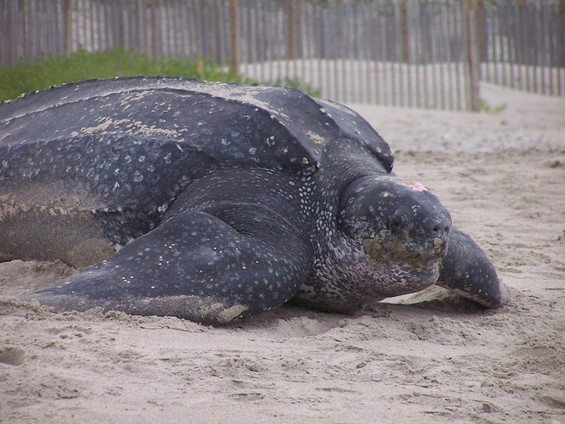

# Leatherback turtle

### Dermochelys coriacea

<figcaption>Photo: USFWS</figcaption>

### Overall vulnerability:

High

### Conservation status:

Federally Endangered

## General Information

Dark and striking, the leatherback is the largest species of turtle on Earth, reaching lengths of up to 6 feet and weights up to 1,500 pounds.  Leatherback’s are named for their unique shell composition – while most turtles have hard shells, leatherback shells are comprised of a thick layer of fatty tissue and tiny bones covered with a layer of skin that gives the appearance of leather.  Leatherback sea turtles have a wide range throughout the waters of the Atlantic, Pacific and Indian Oceans.  Females nest on sandy beaches throughout this range, including in Florida.  Leatherback sea turtles eat a diet primarily of jellyfish.  Females typically emerge from the sea to build their nests under the cover of darkness during the summer months, averaging about 75 eggs per clutch.

## Habitat Requirements

Leatherback sea turtles have a distribution that includes large portions of the Atlantic, Pacific and Indian Oceans. They require sandy beaches for nesting habitat.

**TODO: habitat crosslinks**

**TODO: habitat map (if exists)**

## Climate Impacts

Leatherback sea turtles face significant current threats even in the absence of climate change.  The global population of this endangered species has been highly stressed from accidental capture and entanglement in commercial fishing equipment.  Turtles that become trapped or entangled are not able to escape and ultimately drown.  Leatherback turtles can also be injured or killed by accidentally ingesting plastic debris that can closely resemble their food source floating in the ocean.  Mortality from accidental capture as well as coastal development and exposure to pollutants has left this species in a poor position to respond to the additional threat of climate change.  Increased coastal disturbance from storm events or shoreline hardening associated with climate change is likely to negatively impact leatherback reproductive success.  Leatherback sea turtles have temperature-dependent sex determination, a mechanism that is not likely to adapt quickly to a warming climate, possibly resulting in imbalanced sex ratios and subsequent reproductive decline over time.

[More information about general climate impacts to species in Florida](/impacts/species).

## Vulnerability Assessment(s)

The overall vulnerability level (High) was based on the following assessment(s).
#### 

<h3><a href="/impacts/vulnerability/sivva/species">Standardized Index of Vulnerability and Value Assessment</a></h3>

Highly vulnerable

 

The primary factors contributing to vulnerability of the leatherback turtle are sea level rise, erosion, presence of barriers, and runoff and storm surge, and synergies with development.   The genetic diversity for this species is low which may impact their adaptive capacity.  The Florida population represent the northern most extent of their nesting distribution.

## Adaptation Strategies

- Conservation and restoration of existing coastal habitat, including preventing over-development and traffic near nesting areas, is critical to increase habitat and species health and resilience at the onset of intensifying climate change.

- Avoiding shoreline hardening methods in favor of nature-based solutions for shoreline protection such as living shorelines may benefit this species.

- Reducing artificial lighting near beaches is an important strategy for improving hatchling survivorship in this species.  While not directly linked to climate change, addressing existing threats is an important first step for this endangered turtle.

- If nesting habitat becomes degraded or sex ratios are impacted by rising temperatures, artificially created or altered nesting habitat to maintain nesting success and optimal sex ratios is a possible adaptation strategy.  For example, shade structures could be added to nesting sites to improve the likelihood of achieving balanced sex ratios.  Programs focused on collecting eggs, incubating them in a controlled setting and releasing hatchlings are a possible strategy for achieving balanced sex ratios and improving reproductive outcomes and hatchling survivorship in increasingly challenging conditions.

[More information about adaptation strategies](/strategies).

## Additional Resources

- [Florida Fish and Wildlife Conservation Commission Species Profile](https://myfwc.com/wildlifehabitats/profiles/reptiles/sea-turtles/leatherback-turtle/)

- [Multi-Species Recovery Plan for South Florida](https://ecos.fws.gov/docs/recovery_plan/sfl_msrp/SFL_MSRP_Species.pdf)
