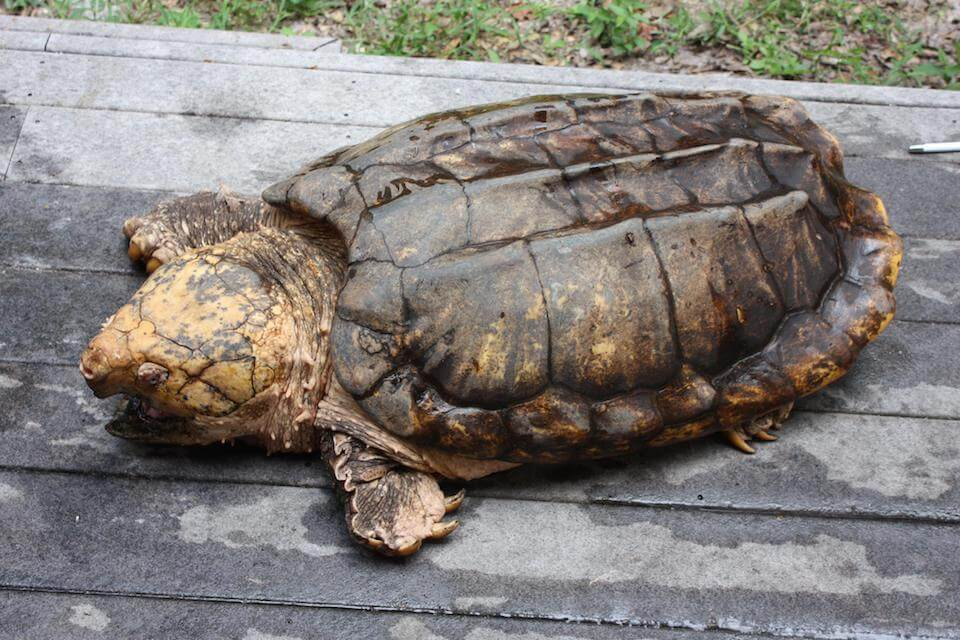

# Alligator snapping turtle

### Macrochelys temminckii

<figcaption>Photo: FWC</figcaption>

### Conservation status:

State Species of Special Concern

### Overall vulnerability:

Not Assessed

The largest freshwater turtle in North America, the alligator snapping turtle throughout the United States from the Florida panhandle to Texas and northwards to Illinois.  Alligator snapping turtles have markedly long tails and curved beaks well-equipped for their diet of smaller turtles, fish, plants and acorns.  In Florida, alligator snapping turtles nest in the springtime, preferring to excavate their nests in sandy soils.

## Habitat Requirements

Alligator snapping turtles can be found in a variety of freshwater habitats including backwater swamps, rivers, and lakes.  They are occasionally found in low salinity brackish environments as well.

**TODO: habitat crosslinks**

**TODO: habitat map (if exists)**

## Climate Impacts

Alligator snapping turtle habitat in Florida is currently at high risk from human development in the area, which is likely to worsen with climate change.  Sedimentation from human activity or severe precipitation events made more frequent by climate change can introduce many particulates into the water, causing siltation and decreased photosynthesis in aquatic plants. Changing weather patterns as well as more extreme temperatures due to climate change can adversely affect the fitness and reproductive success of this species. Water quality changes due to pollution and saltwater infiltration from sea level rise can also cause habitat degradation and loss of life.  Like many reptiles, alligator snapping turtles have temperature-dependent sex determine and embryos become female when incubation temperature rises above 84 degrees Fahrenheit.   Substantially warmer temperatures over time could lead to imbalanced sex ratios in the species.

[More information about general climate impacts to species in Florida](/impacts/species).

## Vulnerability Assessment(s)

This species was not assessed for vulnerability.

## Adaptation Strategies

- Conservation and restoration of existing wetland habitat, especially targeted at reducing sedimentation, is critical to increase habitat and species health and resilience at the onset of intensifying climate change.

- Monitoring natural community shifts to prioritize areas for conservation is an important first step in ensuring snapping habitat can be conserved in a future climate.  As locations of prime habitat are likely to shift under climate change, monitoring can help conservationists get ahead of natural shifts and understand where to best focus their efforts.  This strategy is also important to mitigate extensive habitat loss from altered human land use patterns in a changing climate.

- If nesting habitat becomes degraded or sex ratios are impacted by rising temperatures, artificially created or altered nesting habitat to maintain nesting success and optimal sex ratios is a possible adaptation strategy.  For example, shade structures could be added to nesting sites to improve the likelihood of achieving balanced sex ratios.

[More information about adaptation strategies](/strategies).

## Additional Resources

- [Florida Fish and Wildlife Conservation Commission Species Profile](https://myfwc.com/wildlifehabitats/profiles/reptiles/freshwater-turtles/alligator-snapping-turtle/)
