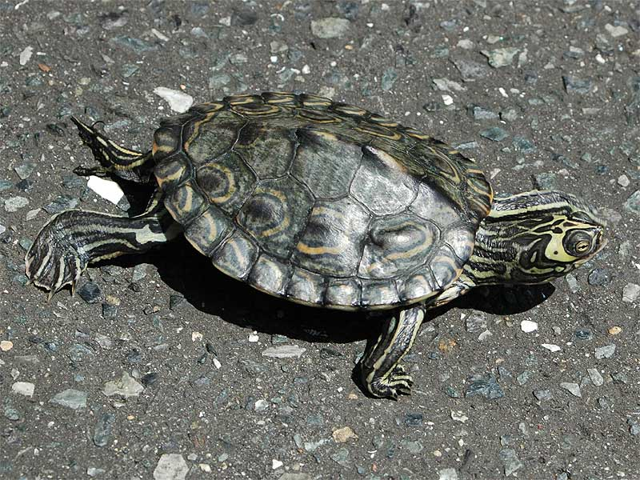

# Barbour’s map turtle

### Graptemys barbouri

<figcaption><a href="https://commons.wikimedia.org/w/index.php?curid=10961672" target="_blank" rel="noopener noreferrer">Photo: maimaip2000</a></figcaption>

### Conservation status:

State Threatened

### Overall vulnerability:

Not Assessed

Although not large compared to many turtle species, Barbour’s map turtles are the largest of map turtles.  Their size varies dramatically by sex – female shell length can reach around 11 inches while male shell length only reaches about 6 inches.  This turtle has a large head, useful for crushing their mollusk prey.  Barbour’s map turtles have a small range limited to river systems within the Florida panhandle and southern Georgia.

## Habitat Requirements

Barbour’s map turtles most commonly occur in the main channels of large rivers with adequate flow.

**TODO: habitat crosslinks**

**TODO: habitat map (if exists)**

## Climate Impacts

Sedimentation from human activity or severe precipitation events made more frequent by climate change can introduce many particulates into river systems, causing siltation and decreased photosynthesis in aquatic plants. Changing weather patterns as well as more extreme temperatures due to climate change can adversely affect the fitness and reproductive success of this species. Water quality changes due to pollution and saltwater infiltration from sea level rise can also cause habitat degradation and loss of life.  Like many reptiles, Barbour’s map turtles have temperature-dependent sex determination and embryos become female when incubation temperature rises above 84 degrees Fahrenheit.   Substantially warmer temperatures over time could lead to imbalanced sex ratios in this species.

[More information about general climate impacts to species in Florida](/impacts/species).

## Vulnerability Assessment(s)

This species was not assessed for vulnerability.

## Adaptation Strategies

- Conservation and restoration of existing riparian habitat, especially targeted at reducing sedimentation, is critical to increase habitat and species health and resilience at the onset of intensifying climate change.

- Monitoring natural community shifts to prioritize areas for conservation is an important first step in ensuring turtle habitat can be conserved in a future climate.  As locations of prime habitat are likely to shift under climate change, monitoring can help conservationists get ahead of natural shifts and understand where to best focus their efforts.  This strategy is also important to mitigate extensive habitat loss from altered human land use patterns in a changing climate.

- If nesting habitat becomes degraded or sex ratios are impacted by rising temperatures, artificially created or altered nesting habitat to maintain nesting success and optimal sex ratios is a possible adaptation strategy.  For example, shade structures could be added to nesting sites to improve the likelihood of achieving balanced sex ratios.

[More information about adaptation strategies](/strategies).

## Additional Resources

- [Florida Fish and Wildlife Conservation Commission Species Profile](https://myfwc.com/wildlifehabitats/profiles/reptiles/freshwater-turtles/barbours-map-turtle/)
