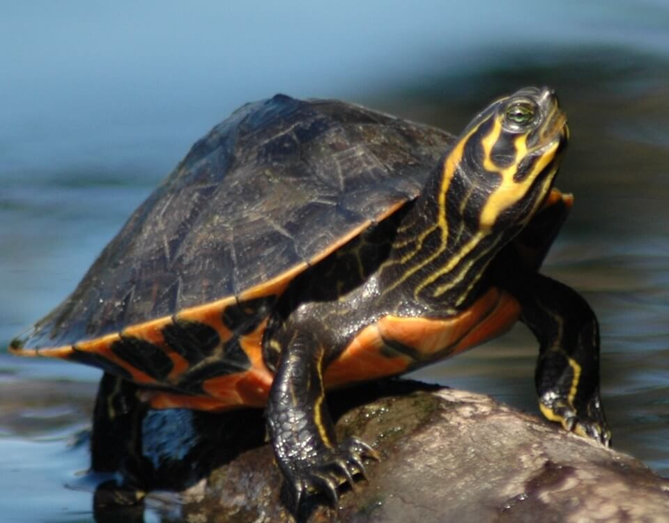

# Suwannee cooter

### Pseudemys concinna suwanniensis

<figcaption>Photo: FWC</figcaption>

### Overall vulnerability:

Very Low

### Conservation status:

Species of Greatest Conservation Need

## General Information

Found in the northwestern peninsula and panhandle of Florida, the aquatic Suwannee cooter is the largest species of turtle in its family.  This turtle reaches a length of approximately 17 inches and has a black shell colored with yellow and orange markings that develop with age.  The Suwannee cooter is herbivorous and relies on a diet of aquatic plants. These turtles emerge from the water to nest from March through August, during when thy carefully choose nesting sites with ample drainage and sunlight. Incubation lasts approximately 86 days.  This species is slow maturing - male Suwannee cooters reach maturity in 8 to 10 years while females reach maturity in 9 to 13 years.

## Habitat Requirements

As an aquatic species, the Suwannee Cooter inhabits rivers, streams, and springs from the Tampa Bay area up to the panhandle, west of Tallahassee. This turtle species prefers blackwater streams, alluvial rivers, and spring-fed rivers where there is an abundance of aquatic vegetation and areas for them to bask in the sunlight.

**TODO: habitat crosslinks**

**TODO: habitat map (if exists)**

## Climate Impacts

Suwannee Cooter habitat is currently at high risk from human development in the area, which is likely to worsen with climate change.  Sedimentation from human activity or severe precipitation events made more frequent by climate change can introduce many particulates into the water, causing siltation and decreased photosynthesis in aquatic plants. Changing weather patterns as well as more extreme temperatures due to climate change can adversely affect the fitness and reproductive success of this species. Water quality changes due to pollution and saltwater infiltration from sea level rise can also cause habitat degradation and loss of life.

[More information about general climate impacts to species in Florida](/impacts/species).

## Vulnerability Assessment(s)

The overall vulnerability level (Very Low) was based on the following assessment(s).
#### 

<h3><a href="/impacts/vulnerability/sivva/species">Standardized Index of Vulnerability and Value Assessment</a></h3>

Slightly vulnerable

 

No factors identified as significantly contributing to the vulnerability of the Suwannee cooter.

## Adaptation Strategies

- Conservation and restoration of existing wetland habitat, especially targeted at reducing sedimentation, is critical to increase habitat and species health and resilience at the onset of intensifying climate change.

- Monitoring natural community shifts to prioritize areas for conservation is an important first step in ensuring cooter habitat can be conserved in a future climate.  As locations of prime habitat are likely to shift under climate change, monitoring can help conservationists get ahead of natural shifts and understand where to best focus their efforts.  This strategy is also important to mitigate extensive habitat loss from altered human land use patterns in a changing climate.

[More information about adaptation strategies](/strategies).

## Additional Resources

- [Florida Fish and Wildlife Conservation Commission Species Profile](https://myfwc.com/wildlifehabitats/profiles/reptiles/freshwater-turtles/suwannee-cooter/)
