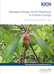

<content-header icon="resources" title="Additional Resources for Adaptation Strategies"></content-header>

The following adaptation guides provide additional information and resources for creating your own adaptation strategies.

- [National Fish, Wildlife, and Plants Climate Adaptation Strategy](#WAS)
- [Climate Smart Conservation: Putting Adaptation into Practice](#CSC)
- [Embracing Change: Adapting Conservation Approaches to Address a Changing Climate](#WCS)
- [Promoting Resilience in Marine Ecosystems](#IUCN)

There is more information available on the [additional resources for climate impacts page](/impacts/resources) that may help inform your adaptation strategies.

## [National Fish, Wildlife, and Plants Climate Adaptation Strategy](https://www.wildlifeadaptationstrategy.gov/strategy.php)

by: National Fish, Wildlife and Plants Climate Adaptation Partnership. 2012. National Fish, Wildlife and Plants Climate Adaptation Strategy, Association of Fish and Wildlife Agencies, Council on Environmental Quality, Great Lakes Indian Fish and Wildlife Commission, National Oceanic and Atmospheric Administration, and U.S. Fish and Wildlife Service. Washington, D.C.

This nationwide strategy is the product of an interagency steering committee, consisting of members at both the state and federal levels. The purpose of the Strategy is to inspire and enable natural resource professionals and other decision makers to take action to conserve the nation’s fish, wildlife, plants, and ecosystem functions, as well as the human uses and values these natural systems provide, in a changing climate. This document provides an excellent starting point for examining broad approaches to climate adaptation and provide key successes that serve as examples for how to best to begin employing appropriate climate adaptation strategies.

This strategy outlines 7 primary goals:

- Conserve habitat to support healthy fish, wildlife, and plant populations and ecosystem functions in a changing climate.
- Manage species and habitats to protect ecosystem functions and provide sustainable cultural, subsistence, recreational, and commercial use in a changing climate.
- Enhance capacity for effective management in a changing climate.
- Support adaptive management in a changing climate through integrated observation and monitoring and use of decision support tools.
- Increase knowledge and information on impacts and responses of fish, wildlife and plants to a changing climate.
- Increase awareness and motivate action to safeguard fish, wildlife, and plants in a changing climate.
- Reduce non-climate stressors to help fish, wildlife, plants, and ecosystems adapt to a changing climate.

## [Climate Smart Conservation: Putting Adaptation into Practice](https://www.nwf.org/climatesmartguide)

by: Stein, B.A., P. Glick, N. Edelson, and A. Staudt, editors. 2014. National Wildlife Federation, Washington, D.C.

The goal of this guide is to aid policy makers and practitioners in recognizing, designing, and employing good climate-smart conservation strategies and goals. It offers strategies for carrying out conservation in a rapidly changing climate.

Climate-smart conservation is defined as “the intentional and deliberate consideration of climate change in natural resource management, realized through adopting forward-looking goals and explicitly linking strategies to key climate impacts and vulnerabilities.”

The guide examines four key themes of climate-smart conservation:

1. act with intentionality
2. manage for change, not just persistence
3. reconsider goals, not just strategies
4. integrate adaptation into existing work

Climate-smart conservation can be described as an approach that:

- links actions to climate impacts
- embraces forward-looking goals
- considers the broader landscape context
- adopts strategies robust to uncertainty
- employs agile and informed management
- minimizes its carbon footprint
- accounts for climate influence on its success
- safeguards people and nature
- avoids maladaptation

## [Embracing Change: Adapting Conservation Approaches to Address a Changing Climate](https://www.wcsclimateadaptationfund.org/resources)

The goal of this report is to help conservationists learn how to move beyond business-as-usual conservation approaches and make their work climate informed. Twelve real-world examples of how conservation practitioners around the United States are modifying their approaches to support the capacity of wildlife and ecosystems to adapt to a changing climate.

Integrating climate change into conservation planning can reveal the need for strategic and forward-looking adjustments in the WHAT, WHERE, WHEN and WHY of conservation efforts.

#### WHAT - Taking Climate-Informed Actions

Practitioners are introducing new or modifying current actions in ways that make them more effective in light of climate variability and projected changes.

#### WHERE - Working in Strategic Locations

Conservationists are working in new or strategic locations to target places where longer-term maintenance of species, populations, ecosystem services, or other values is more likely.

#### WHEN - Shifting the Urgency and Timing of Actions

To stay ahead or keep pace with a changing climate, the need for action may become more urgent, or actions may be needed at different times of year.

#### WHY - Embracing Forward-Looking Goals

The goal of conservation projects may evolve as climate change affects a place or ecosystem, leading practitioners to focus on new threats or targets.

## Promoting Resilience in Marine Ecosystems

Published by the World Conservation Union (IUCN), this series of publications provides information on management tools to promote resilience in marine
ecosystems:

[Managing Mangroves for Resilience to Climate Change](https://portals.iucn.org/library/sites/library/files/documents/2006-041.pdf)

by: McLeod, E. and R.V. Salm. 2006. IUCN, Gland, Switzerland.

[Managing Seagrasses for Resilience to Climate Change](https://www.reefresilience.org/pdf/Managing_Seagrasses_for_Resilience_to_Climate_Change.pdf)

by: Björk M., F. Short, E. Mcleod, and S. Beer. 2008. IUCN, Gland, Switzerland.

[Coral Reef Resilience and Resistance to Bleaching](https://portals.iucn.org/library/sites/library/files/documents/2006-042.pdf)

by: Grimsditch, G.D. and R.V. Salm. 2006. IUCN, Gland, Switzerland.

